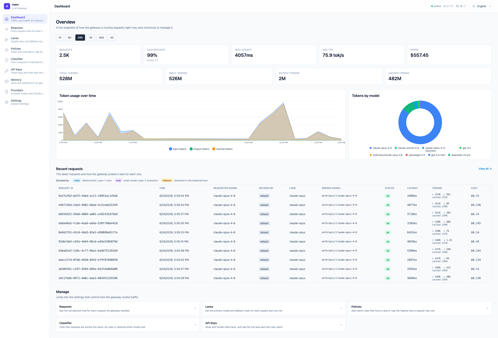
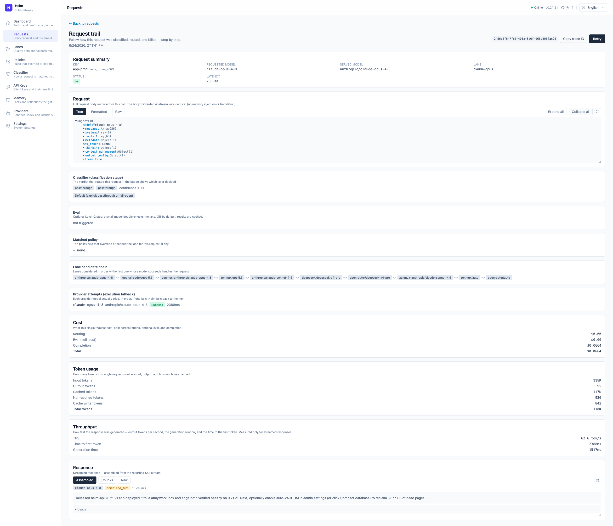
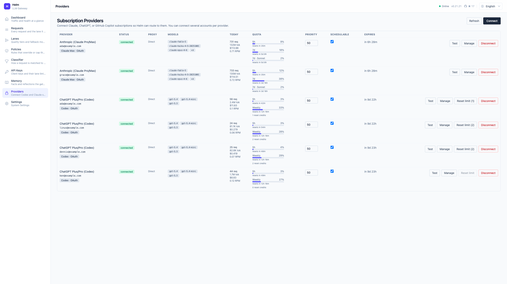
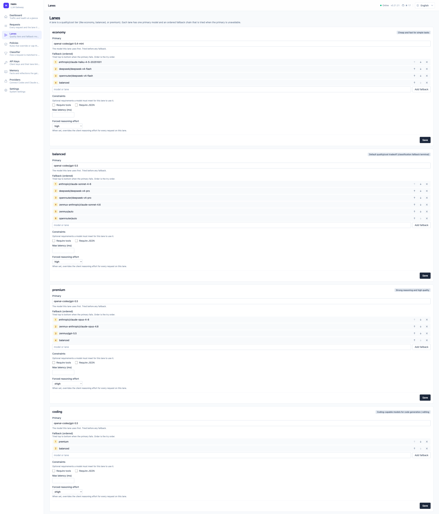
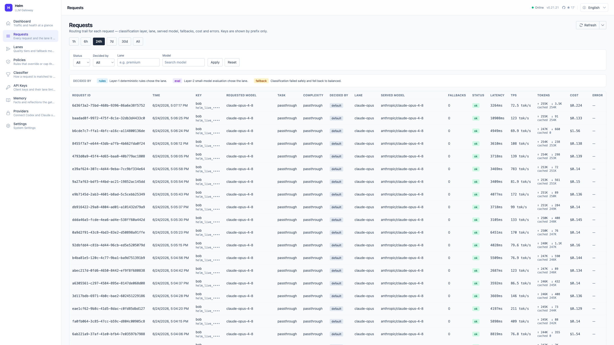
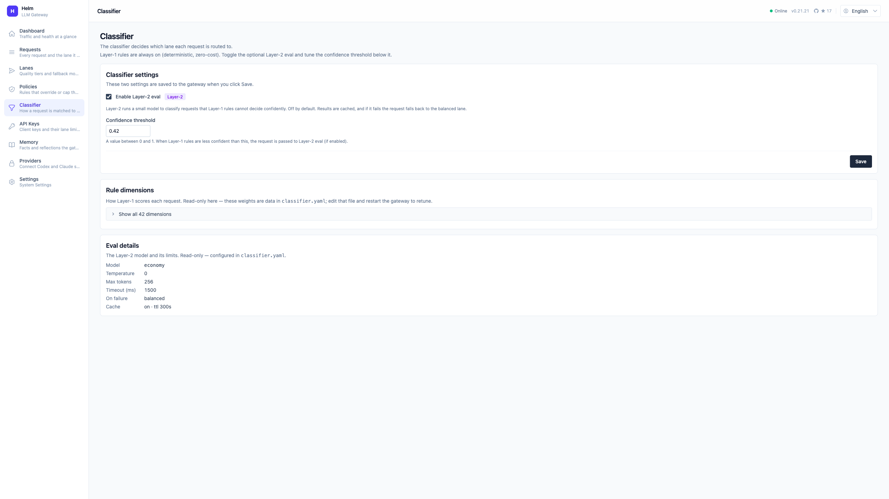
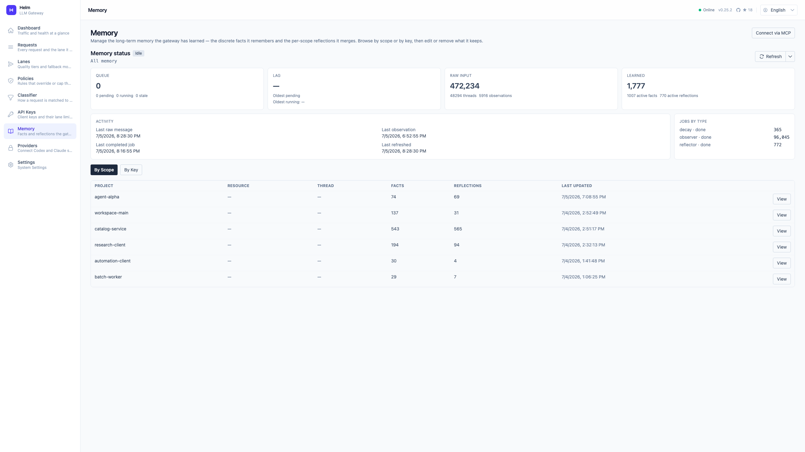
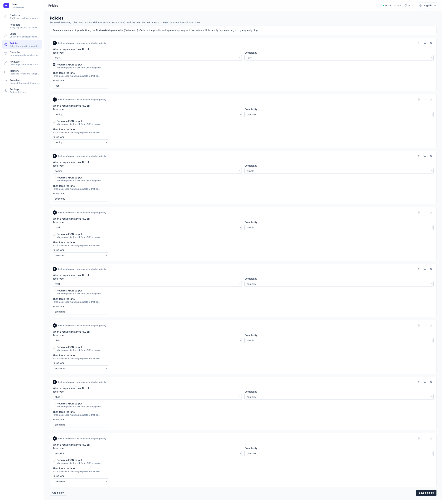
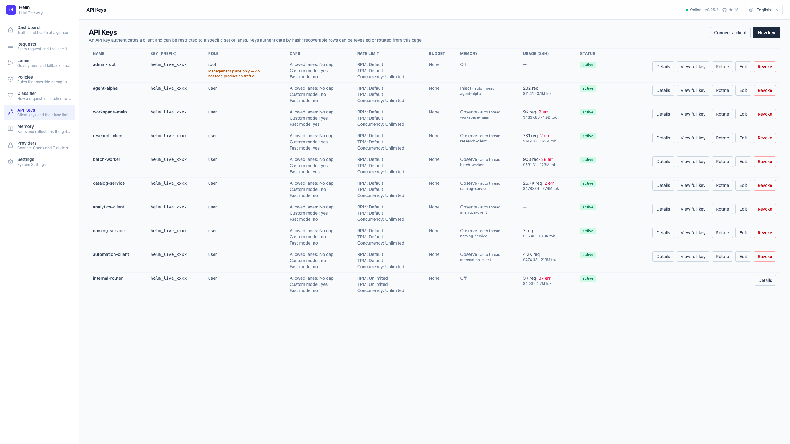
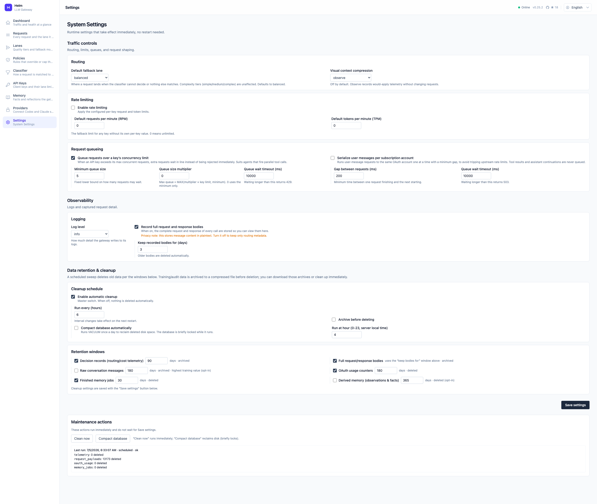

<div align="center">


# Helm API

**English** · [简体中文](README.zh-CN.md)

### One gateway in front of every LLM provider. Pick models by config, not code.

Open-source · self-hosted · MIT

[](LICENSE)
[](package.json)
[](package.json)
[](tsconfig.base.json)
[](https://hono.dev)
[](https://kit.svelte.dev)

</div>

You maintain fallback logic, provider quirks, cost trade-offs, and model churn — copied into every client. That work belongs in one place, behind one interface.

Helm API is that place: an open-source, self-hosted **LLM routing gateway** — *nginx for the LLM world*. Your app sends a normal OpenAI, Anthropic, or Gemini request. A declarative YAML config decides which model answers, fails over when a provider breaks, translates protocols both ways, and records every decision. Clients set a `base_url` and an API key. Nothing else.

> **Manage traffic as configuration, not as code.**

```python
# Your app: the same OpenAI client, just a new base_url and key.
client = OpenAI(base_url="http://localhost:8080/v1", api_key="<helm-key>")
client.chat.completions.create(model="auto", messages=[...])   # Helm classifies and routes
```

Change the model behind a lane? Edit one YAML line — or click in the dashboard. Your apps never notice.

<div align="center">

[](docs/assets/screenshots/01-dashboard.png)

<sub>The dashboard — live traffic, token usage by model, spend, and the most recent routing decisions.</sub>

</div>

## Quickstart

**Prerequisites:** [Docker](https://docs.docker.com/get-docker/), or **Node ≥ 22** + **pnpm 10** to build from source.

```bash
# 1. Clone and create your env file
git clone https://github.com/EasyMetaAu/helm-api.git && cd helm-api
cp .env.example .env
#    In .env, set HELM_ADMIN_PASSWORD and at least DEEPSEEK_API_KEY

# 2. Start it
docker compose up -d

# 3. Copy the root API key — generated and printed once on first boot
docker compose logs helm | grep -i "root API key"
```

| What | Where |
|---|---|
| Gateway | `http://localhost:8080` (status landing page at `/`) |
| Dashboard | `http://localhost:8080/admin` — `HELM_ADMIN_USER` / `HELM_ADMIN_PASSWORD` |
| API docs | `GET /docs` (Swagger UI) · `GET /openapi.json` (OpenAPI 3.1, generated from the same Zod schemas the gateway validates with) |
| Health / version | `GET /healthz` · `GET /version` |

`docker-compose.yml` mounts `./config` and `./data` — config and database survive restarts. Credentials enter via environment variables only, never the image.

## What you get

|  | Feature | Detail |
| :---: | :--- | :--- |
| 🔀 | **Four client protocols** | OpenAI Chat, Anthropic Messages, OpenAI Responses, Google Gemini — all streaming + non-streaming. One IR in the middle: any client reaches any backend with a consistent output shape, SSE included. |
| 🧭 | **Three-layer classification** | Deterministic rules (pure, zero-network, unit-tested — always on) → optional small-model eval (`temperature: 0`, cached, off by default — needs a configured eval model) → `balanced` lane as the fail-open sink. |
| 🛣️ | **Lanes + policies** | Requests route through lanes (`economy` / `balanced` / `premium`, plus task lanes `coding`, `json`, `vision`, `tool_use`), never raw provider names. First-match policies pin or cap the lane. Each lane = a primary model + a fallback chain, all in config. Opt-in Agentic Signals can promote a degraded lane within those caps. |
| 🪪 | **Drop-in for fixed-model clients** | A client that hard-codes a vendor model id (Claude Code's `claude-opus-4-8`, an SDK locked to `gpt-5.5`) just works — no *400 unknown model*. A **standard key** classifies it like `auto`; a **custom-model key** can map each vendor family onto a lane via `model-aliases.yaml` (cap-bounded). |
| 🛡️ | **Resilient execution** | Circuit breaker (OPEN/HALF_OPEN + single probe), capability filter with explicit skip reasons, `:free`-tier 429 skipping, per-key concurrency queueing. Client disconnects are never counted as provider faults. |
| 🔐 | **OAuth subscriptions** | Route your Claude Pro/Max, ChatGPT Codex, and GitHub Copilot subscriptions as backends — pooled accounts, per-account model curation / egress proxy / scheduling, all hot-reloaded. *(Opt-in; read the [ToS warning](#oauth-subscription-providers-claude-promax-chatgpt-codex-github-copilot).)* |
| 🔑 | **Keys with teeth** | Mandatory auth; keys stored as SHA-256 hashes only. Per key: lane whitelist, custom-model permission, RPM/TPM limits, usage budgets (degrade or reject), concurrency cap, memory mode. Revoke softly, then delete permanently. |
| 🧠 | **Memory middleware** | On by default: remembered context is injected before routing as a trailing turn; a background worker compresses and consolidates — compaction is **auto-adaptive and zero-config** (prices and context windows resolve from the model catalog; size / idle / context-pressure triggers). Summarize/merge default to deterministic local logic, with an **opt-in LLM path** (`config.memory.llm`, off by default). A forgetting/tiering layer (decay, reinforcement, retention) keeps it honest. Opt out per key or per request (`x-memory-mode: off`). |
| 📊 | **Total observability** | A redacted decision record per request — classifier, policy, lane, every provider attempt, latency, fallbacks, cost. Verbatim payload capture to a separate table (on by default, 30-day retention). A payload inspector reads long fields fullscreen, previews inline images, and an editable **Retry** button replays any captured request in its own protocol. |
| 🖥️ | **Admin dashboard** | SvelteKit SPA at `/admin` behind HTTP Basic: overview, key CRUD, lane/policy/classifier editors, system settings, drill-down request log. Edits **write back to `config/*.yaml`** (comment-preserving, atomic) and rebind live — no restart, and they survive one. Five languages. |
| 💾 | **Storage** | SQLite by default (one local file). Postgres / Supabase behind the same Store-port abstraction — switch with one env var. |

**Roadmap:** Account/customer billing is intentionally out of scope. See [09 Roadmap](docs/09-roadmap.md).

## Inside the dashboard

The gateway ships a SvelteKit console at `/admin` (HTTP Basic, five languages). Everything here is live — edits write back to `config/*.yaml` and rebind on the next request, no restart.

**Every request, fully explained.** Open any request to follow the whole trail: which layer classified it, the policy that applied, the lane's full candidate chain, each provider actually tried, and the cost split down to cached tokens.

[](docs/assets/screenshots/03-request-trail.png)

**A payload inspector built for debugging.** With verbatim capture on, the same page loads the full request and response bodies as a collapsible tree (or Formatted / Raw):

- **Read anything.** Pop any oversized field — a giant system prompt, a tool schema, a continued-session summary — into a fullscreen, copyable reader instead of scrolling a wrapped cell.
- **See the multimedia.** Inline base64 or remote images render in place, with zoom, fit-to-window, and open-in-new-tab.
- **Edit and replay.** Hit **Retry**, tweak the body, and re-send it in its original protocol (OpenAI Chat, Anthropic, Responses, or Gemini) as an isolated, newly-traced debug run.

**Pool your subscriptions.** Route Claude Pro/Max, ChatGPT Codex, and GitHub Copilot logins as backends — several accounts per provider, each with its own model curation, egress proxy, priority, and live quota.

[](docs/assets/screenshots/06-providers.png)

**Routing is just config.** Each lane is a primary model plus an ordered fallback chain — reorder, swap, or constrain it from the UI or the YAML.

[](docs/assets/screenshots/04-lanes.png)

<details>
<summary><b>See every admin screen</b> — all 10 screenshots (click to expand)</summary>

<br>

| | |
|:--:|:--:|
| [](docs/assets/screenshots/01-dashboard.png)<br>**Dashboard** — traffic, spend, token usage, recent decisions | [](docs/assets/screenshots/02-requests.png)<br>**Requests** — the filterable request log |
| [](docs/assets/screenshots/03-request-trail.png)<br>**Request trail** — the full per-request decision trail | [](docs/assets/screenshots/04-lanes.png)<br>**Lanes** — primary + ordered fallback chain per lane |
| [](docs/assets/screenshots/05-classifier.png)<br>**Classifier** — eval toggle, threshold, rule weights | [](docs/assets/screenshots/06-providers.png)<br>**Providers** — pooled OAuth subscription accounts |
| [](docs/assets/screenshots/07-memory.png)<br>**Memory** — facts & reflections by scope or key | [](docs/assets/screenshots/08-policies.png)<br>**Policies** — first-match rules that pick or cap the lane |
| [](docs/assets/screenshots/09-keys.png)<br>**API Keys** — per-key caps, limits, budgets, memory mode | [](docs/assets/screenshots/10-settings.png)<br>**Settings** — payload capture, rate limits, queue, DB maintenance |

Each screen is annotated in **[11 · Admin UI](docs/11-admin-ui.md)**.

</details>

## Two failure disciplines

This is the design rule everything else hangs off:

- **Config and credentials are fail-closed.** Invalid YAML, a missing required key, an unknown store driver — the gateway refuses to start. It never runs half-configured.
- **The request path is fail-open.** Classification, eval, memory, cache — any optional step that stumbles degrades quietly to the `balanced` lane and gets logged. A client sees a structured error only when *every* provider in the chain is genuinely down.

And two fallbacks that are never conflated: *classification fallback* (undecided → `balanced` lane) and *execution fallback* (provider failed → next model in the chain). Separate mechanisms, separate decision-record fields — you can always tell which one fired.

## Architecture

Four client protocols enter one stable interface; one framework-agnostic core does the work; config drives every stage. (For the same pipeline as sequence, flow, and state diagrams, see **[Architecture & Data Flow](docs/architecture.md)**.)

```text
CLIENT ── OpenAI · Anthropic · OpenAI Responses · Google Gemini
          one base_url + one Helm key · send model:"auto"
             │
             ▼
GATEWAY   apps/gateway (Hono) · thin HTTP shell — also serves /admin SPA + /docs
             │   normalize any protocol  ──▶  one InternalRequest (IR)
             ▼
CORE      packages/core · the routing brain (imports no web framework)
             │
             ├─ auth        resolve sha256 key, load per-key caps        · fail-closed
             ├─ gate        rate limit (off) · usage budget (off)        · fail-closed
             ├─ memory      inject remembered context (on by default)    · fail-open
             ├─ classify    L1 rules ─uncertain→ L2 eval (off) ─→ balanced · fail-open
             ├─ resolve     alias shim · explicit model · first-match policy
             │                  └─▶ lane → caps (+ signals) → fallback chain
             ├─ execute     capability filter → circuit breaker → provider
             │                  └── on failure: advance to next model in the chain
             └─ translate   provider-native  ⇄  IR  ⇄  client protocol (streaming SSE)
             │
             ▼
RESULT ── streamed/JSON response, in the client's own protocol
             │
             ├─▶ telemetry   redacted decision record + verbatim payload capture
             ├─▶ memory      write back the turn
             └─▶ upstream    static API keys + OAuth subscriptions (pooled · hot-reload)

config/*.yaml drives every stage · Zod-validated · invalid config refuses to boot (fail-closed)
```

The core is **headless by contract**: routing, classification, provider execution, protocol translation, and storage live in `packages/core` and import no web framework — an architecture test enforces it. Hono and SvelteKit are thin, optional shells.

```text
helm-api/
├─ apps/
│  ├─ gateway/   # Hono API + serves the dashboard + /healthz, /version
│  └─ admin/     # SvelteKit + Tailwind dashboard (static SPA)
├─ packages/
│  ├─ core/      # routing, classification, providers, protocol translation, storage ports (no framework)
│  └─ shared/    # Zod schemas + shared types (single source of truth)
├─ config/       # default lanes / policies / classifier / providers / model-aliases / … YAML
├─ docs/         # documentation (start at docs/README.md)
└─ scripts/      # sync:catalog and other build-time tools
```

## Calling the gateway

Any OpenAI-compatible client works. Point it at Helm with a Helm key:

```bash
curl http://localhost:8080/v1/chat/completions \
  -H "Authorization: Bearer $HELM_KEY" \
  -H "Content-Type: application/json" \
  -d '{
    "model": "auto",
    "messages": [{"role": "user", "content": "Explain consistent hashing in two sentences."}],
    "stream": true
  }'
```

| Endpoint | Protocol | Streaming |
|---|---|---|
| `POST /v1/chat/completions` | OpenAI Chat Completions | ✅ |
| `POST /v1/messages` | Anthropic Messages | ✅ |
| `POST /v1/responses` | OpenAI Responses | ✅ |
| `POST /v1beta/models/{model}:generateContent` | Google Gemini | ✅ (via `:streamGenerateContent`; auth via `x-goog-api-key`) |

**What to put in `model`:**

| Value | What Helm does |
|---|---|
| `auto` *(recommended)* | Classifies the request and routes it to the best lane. |
| any model/lane on a **standard key** | The `model` field is **ignored** — Helm classifies and routes exactly as if you'd sent `auto` (never a 400). |
| a pinned vendor id, e.g. `claude-opus-4-8` — **custom-model key** | The compatibility shim maps it onto a lane (`config/model-aliases.yaml`), cap-bounded by the key's lanes. |
| a lane name (`premium`) or exact alias (`deepseek/deepseek-v4-pro`) — **custom-model key** | Routes straight into that lane / model, skipping classification. |

> A standard key only ever needs `auto` — Helm classifies everything and the `model` field is ignored. Pinning a lane, a vendor family, or an exact model requires a **custom-model** key (`allow_custom_model`). Lanes are operator config (`lanes.yaml` + dashboard).

**Other endpoints** (full interactive docs at `/docs`, raw spec at `/openapi.json`):

| Endpoint | Auth | Purpose |
|---|---|---|
| `GET /` · `GET /healthz` · `GET /version` | — | Landing page · readiness · build info |
| `GET /v1/models` · `GET /v1/models/{id}` | API key | Models the key can route to (lanes + `auto`; concrete aliases with capabilities & pricing for custom-model keys) |
| `/admin` · `/admin/api/*` | Basic auth | Dashboard + its JSON backend (mounted only when admin is enabled) |

## Configuration

Everything lives in `config/*.yaml`, Zod-validated on load. **Invalid config stops the gateway from starting.** Lanes, policies, the classifier, and system settings are also editable live in the dashboard — edits persist back to the YAML files (comments preserved) and apply on the next request.

| File | Controls | Live-editable |
|---|---|---|
| `server.yaml` | Host / port / base path | — |
| `auth.yaml` | API key requirement + first-run root key | — |
| `runtime.yaml` | Request limits, rate-limit defaults, storage driver, opt-in signal feedback | partial |
| `providers.yaml` | Upstream providers + model aliases (credentials by env-var **name** only) | — |
| `lanes.yaml` | Each lane's primary model + fallback chain (quality, task, and vendor-family lanes) | ✅ persists |
| `policies.yaml` | First-match rules that pick or cap the lane | ✅ persists |
| `classifier.yaml` | Built-in rules + the optional eval model | ✅ persists |
| `model-aliases.yaml` | Maps a pinned vendor model id → lane / `auto` (compatibility shim, optional) | — |
| `memory.yaml` | Forgetting/tiering knobs (on in the shipped config) · optional compaction trigger overrides (`compaction:`) · optional LLM summarizer (`llm:`, off by default). A leftover `observer:` block from older configs refuses startup | ✅ |
| `capabilities.yaml` / `pricing.yaml` | Manual overrides on the model catalog (incl. prompt-cache read/write prices) | — |

Most-used environment variables (env wins over YAML; full list in [`.env.example`](.env.example)):

| Variable | Purpose |
|---|---|
| `DEEPSEEK_API_KEY` | Primary provider credential (**required**) |
| `ZENMUX_API_KEY`, `OPENROUTER_API_KEY` | Optional provider credentials (provider skipped if missing) |
| `HELM_ADMIN_USER` / `HELM_ADMIN_PASSWORD` | Dashboard login (Basic auth) |
| `HELM_HOST` / `HELM_PORT` | Server binding (default `0.0.0.0:8080`) |
| `HELM_STORE_DRIVER` | `sqlite` (default) or `supabase` |
| `HELM_STORE_URL_ENV` | For `supabase`: the **name** of the env var holding the Postgres DSN |
| `HELM_RATE_LIMIT_ENABLED` | Turn rate limiting on (off by default) |
| `HELM_OAUTH_ENC_KEY` | 32-byte key encrypting stored OAuth tokens (**required** if any subscription provider is configured) |

> **Storage.** SQLite (`better-sqlite3`, a `helm.db` file under `./data`) is the default. For Postgres/Supabase, set `HELM_STORE_DRIVER=supabase` and point `HELM_STORE_URL_ENV` at the env var holding your DSN. Unknown drivers fail closed at startup.
>
> **Credentials.** Provider keys are referenced by env-var *name* in `providers.yaml` — plaintext never enters the repo or the image.

### OAuth subscription providers (Claude Pro/Max, ChatGPT Codex, GitHub Copilot)

A provider can authenticate with an **OAuth subscription** instead of a static key: log in from the dashboard (**Providers → Connect**). Claude Pro/Max and ChatGPT Codex use an authorization-code paste; GitHub Copilot uses a device code. Helm stores the rotating refresh token **encrypted at rest** and refreshes access tokens automatically.

Set **`HELM_OAUTH_ENC_KEY`** (32 bytes: base64 or 64 hex chars) — Helm refuses to start if a subscription provider is configured without it. Then add an `oauth: { provider: anthropic | github-copilot | openai-codex }` block to the provider (commented examples in `config/providers.yaml`; for Claude use `type: anthropic`).

Pool **several accounts per provider**. Each account (**Providers → Manage**) gets its own:

- **Models** — a live allow-list, not a display filter: a removed model stops routing immediately; an uncurated model is refused (fail-closed).
- **Proxy** — HTTP/HTTPS/SOCKS5 egress per account, used across the entire subscription flow, so co-hosted accounts exit from distinct IPs.
- **Schedule** — `priority` (lower serves first) + a `schedulable` toggle; round-robin (LRU) within equal priority. Park an account to keep it connected but out of rotation.

Everything hot-reloads — connect, disconnect, curation, proxy, scheduling — next request, no restart. Helm also mirrors each official client's identity headers and sends a **stable per-account device identity** (never rotated mid-stream) to reduce ban-correlation risk.

> ⚠️ **Terms of service.** Routing a Claude/ChatGPT/Copilot **subscription** through a third-party gateway may violate the provider's ToS and can get accounts suspended. This is an opt-in feature for self-hosted personal use — **you are responsible** for compliance with your provider agreements. When in doubt, use a normal API key (`api_key_env`).

## Development

Requires **Node ≥ 22** and **pnpm 10**.

```bash
pnpm install
pnpm dev          # admin dashboard dev server (Vite) — see note below
pnpm test         # Vitest unit tests
pnpm exec vitest run --coverage # unit coverage with source-only include/exclude + thresholds
pnpm test:e2e     # Playwright end-to-end tests
pnpm typecheck    # tsc --noEmit across the workspace
pnpm lint         # Biome
pnpm build        # build the gateway + dashboard
pnpm sync:catalog # refresh the generated model catalog (capabilities + pricing)
```

> `pnpm dev` starts only the admin SPA. The gateway has no watch script — run it built (`pnpm build` then `node apps/gateway/dist/index.js`) or via Docker.

Tests come first: Vitest for the core, Playwright for full flows. Design decisions live in [`implementation-notes.md`](implementation-notes.md). Before a PR:

```bash
pnpm typecheck && pnpm lint && pnpm test && pnpm test:e2e
```

## Documentation

Start at [`docs/README.md`](docs/README.md). For a visual tour of the pipeline, read **[Architecture & Data Flow](docs/architecture.md)**. The numbered specification, in order:

[01 Overview](docs/01-overview.md) ·
[02 Architecture](docs/02-architecture.md) ·
[03 Classification](docs/03-classification.md) ·
[04 Routing & Lanes](docs/04-routing-and-lanes.md) ·
[05 Protocol Translation](docs/05-protocol-translation.md) ·
[06 Auth & Rate Limits](docs/06-auth-and-rate-limits.md) ·
[07 Observability](docs/07-observability.md) ·
[08 Memory Middleware](docs/08-memory-middleware.md) ·
[09 Roadmap](docs/09-roadmap.md) ·
[10 Deployment](docs/10-deployment.md) ·
[11 Admin UI](docs/11-admin-ui.md) ·
[12 Memory Forgetting & Tiering](docs/12-memory-forgetting-and-tiering.md) ·
[13 Memory Admin & MCP](docs/13-memory-admin-and-mcp.md) ·
[14 Memory Deep Recall](docs/14-memory-deep-recall.md) ·
[Protocol Compatibility](docs/protocol-compatibility.md)

## Status

Helm API is a real, end-to-end implementation, not a scaffold. The full pipeline (config → auth → classify → route → execute with circuit-breaking and fallback → protocol translation → telemetry → memory) is wired and covered by an extensive Vitest suite plus Playwright e2e specs. The version badge above tracks the current release.

## License

[MIT](LICENSE) © 2026 EasyMeta AU
