# Helm API — Architecture & Data Flow

> Visual companion to [02 Architecture](02-architecture.md). That chapter explains
> the system in prose; this one draws it — component map, request lifecycle,
> and a per-stage set of sequence, flow, and state diagrams. Everything here is
> traced to the shipping code; where a stage has its own chapter, it is linked.

Diagrams use [Mermaid](https://mermaid.js.org). GitHub renders them inline; in a
plain editor read the fenced source.

---

## 1. The shape of the system

Helm sits between applications and upstream AI providers. Text clients keep one
of four wire protocols against a single `base_url`; dedicated Images and
Interactions routes handle image generation. Boot YAML plus Store-backed runtime
settings decide which provider/model answers, and routed decisions are recorded.

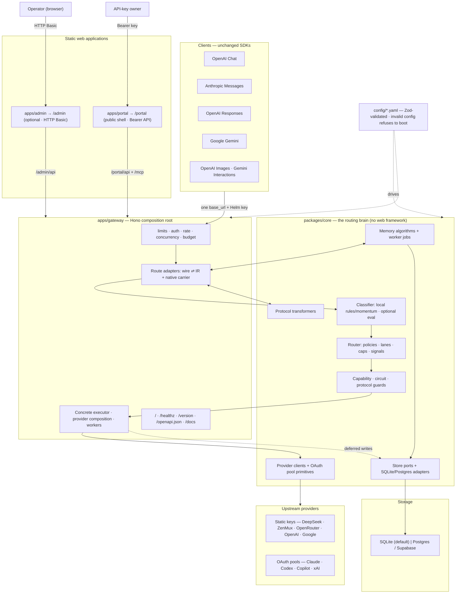

**Reading it:** the gateway owns HTTP and provider composition; core owns the
framework-free routing/storage machinery. Translated requests use one internal
representation (IR), while eligible same-protocol attempts retain and forward a
sanitized native carrier. `packages/core/src/arch.test.ts` scans both core/shared
dependencies and source imports and fails if Hono/Svelte enters either package.

---

## 2. Module boundaries & the headless-core contract

| Package | Responsibility | Imports a web framework? |
|---|---|---|
| `packages/shared` | Zod schemas → the single source of truth for every type (`z.infer`). Defines the IR, `DecisionRecord`, error model, config schemas. | No |
| `packages/core` | Classification, routing, capability/circuit primitives, protocol translation, memory, Store ports, and SQLite/Postgres adapters. | **No (enforced)** |
| `apps/gateway` | Hono composition root: HTTP surfaces, middleware, protocol/native-carrier wiring, concrete execution/provider composition, static hosting, and background workers. | Hono |
| `apps/admin` | SvelteKit static SPA for operators. Calls `/admin/api/*`; imports selected shared wire types but no core/gateway runtime code. | SvelteKit |
| `apps/portal` | SvelteKit static SPA for API-key owners. Calls bearer-scoped `/portal/api/*` and optional `/mcp`; no workspace runtime dependency. | SvelteKit |

The main runtime dependency arrow points inward: `gateway → core → shared`.
Admin has a narrow type dependency on shared; both SPAs communicate with the
gateway at runtime only over HTTP.

Admin mounting/authentication is shipping-environment-only: the loader has no
`admin` YAML field. `HELM_ADMIN_USER` plus `HELM_ADMIN_PASSWORD` auto-enable the
surface unless `HELM_ADMIN_ENABLED=false`; the flag can also enable it explicitly.
Enabled without complete credentials means every Admin request receives 401.

---

## 3. Request lifecycle — the master path

A representative **classified text-generation** request, streaming end to end.
Exact model/lane requests can skip classification/policy; dedicated image routes
use their own image-chain planners.

```mermaid
sequenceDiagram
    autonumber
    participant Cl as Client
    participant GW as Gateway (Hono)
    participant Mem as Memory
    participant Rt as Core Router
    participant Cf as Classifier
    participant Ex as Executor + Breaker
    participant Up as Provider
    participant St as Store (writeQueue)

    Cl->>GW: HTTP request (one of 4 text protocols)
    Note over GW: internal request_id · client trace_id · body-limit · timeout
    GW->>GW: auth → rate-limit → concurrency/budget gates
    Note right of GW: governance gates fail closed before model work
    GW->>GW: transformRequestOut → IR + optional native carrier

    opt key/header memory mode = inject
        GW->>Mem: assemble memory from stored prior turns
        Mem-->>GW: append one trailing system-reminder turn
        Note right of Mem: synchronous and fail-open; live messages stay verbatim
    end
    opt memory mode = observe or inject
        GW->>St: enqueue observeInbound(original turn)
        Note right of St: injection runs first, preventing same-turn self-injection
    end

    GW->>Rt: routeRequest(IR)
    alt exact image/model/lane or compatibility mapping
        Rt->>Rt: explicit/alias plan (classification may be skipped)
    else classified request
        Rt->>Cf: local rules/momentum → optional cached eval
        Note right of Cf: any throw/fallback → configured terminal lane
        Cf-->>Rt: task_type · complexity · decided_by
        Rt->>Rt: policies → lane → policy/key caps → signals
    end
    Rt->>Rt: expand lane → promote eligible requested model → filter blocked models

    Rt->>Ex: execute(candidate_chain)
    loop each candidate until first success
        Ex->>Ex: resolve provider → breaker → capability/protocol/context gates
        alt unavailable / circuit OPEN / compatibility skip
            Note over Ex: push skipped attempt, try next
        else allowed
            Ex->>Up: invoke (translated IR or governed native carrier)
            alt first useful output arrives
                Up-->>Ex: stream/json · recordSuccess
            else retryable pre-output provider failure
                Up-->>Ex: typed error · usually recordFailure → next candidate
            end
        end
    end
    Ex-->>Rt: result or typed 400 / 422 / 499 / 502 / 503

    Rt-->>GW: ExecutionResult + DecisionRecord
    alt native passthrough used
        GW-->>Cl: governed native JSON / byte-relayed SSE
    else translated
        GW->>GW: transformResponseOut / SSE state machine
        GW-->>Cl: response in the client's protocol
    end

    GW->>St: enqueue redacted DecisionRecord + optional verbatim payload
    opt memory mode = observe or inject
        GW->>St: enqueue observeOutbound(assistant/tool result)
    end
    Note right of St: text-path writes are FIFO-batched and drained on shutdown
```

Memory injection is a synchronous read on the hot path. Inbound observation is
enqueued before routing but may flush asynchronously while the request runs;
outbound observation and final telemetry/payload enqueue after a result (and after
the last stream bytes for streaming bookkeeping). The write queue removes Store
commits from the text request's critical path; it does not guarantee that every
write starts only after the client has received the response.

---

## 4. Boot — fail-closed configuration

Helm refuses to run half-configured. The whole config tree is parsed and
Zod-validated before the server binds a port.

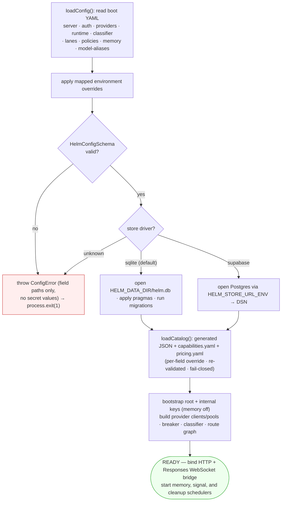

Optional files (`classifier`, `lanes`, `policies`, `memory`, `model-aliases`)
may be **absent** (schema defaults apply) but never **invalid** — a present file
that fails validation still aborts boot. A leftover legacy `observer:` block in
`memory.yaml` is a hard rejection (the schema is `.strict()`), not a silent drop.
When `lanes.yaml` is absent, core's three placeholder `DEFAULT_LANES` are used;
the rich 22-lane deployment inventory comes from the checked-in file, not the
schema fallback. Capability/pricing override files are loaded and validated by
the runtime catalog loader rather than `HelmConfigSchema`.

`server.base_path` / `HELM_BASE_PATH` is another currently inert configuration
surface: it is parsed and validated, but the gateway does not prefix Hono route
mounts with it. Shipping endpoints remain rooted at `/`.

---

## 5. Failure boundaries

The old shorthand "the request path is fail-open" is too broad. Shipping code
separates boot safety, request governance, advisory helpers, and provider
execution:

```mermaid
flowchart TB
    subgraph boot["BOOT — fail closed"]
        direction TB
        a1["invalid YAML / missing required key"]
        a2["unknown store driver"]
        a3["configured OAuth preset without encryption key"]
        a1 & a2 & a3 --> aX["refuse to start<br/>(never run half-configured)"]
    end
    subgraph gov["REQUEST GOVERNANCE — fail closed"]
        direction TB
        g1["bad/disabled API key"]
        g2["rate or budget Store failure"]
        g3["rate/budget/concurrency/model/capability rejection"]
        g1 & g2 & g3 --> gX["reject or typed error<br/>(never silently bypass a cap)"]
    end
    subgraph advisory["ADVISORY / ACCOUNTING — fail open"]
        direction TB
        b1["classification error"]
        b2["eval timeout"]
        b3["memory error"]
        b4["signal read · usage settle · deferred telemetry write"]
        b1 & b2 & b3 & b4 --> bX["terminal lane / unchanged request / logged accounting miss"]
    end
    subgraph exec["PROVIDER EXECUTION — typed fallback"]
        e1["pre-output provider failure"] --> e2["next candidate"]
        e2 --> e3["success or typed terminal<br/>400 · 422 · 499 · 502 · 503"]
    end
    style aX fill:#fee,stroke:#c33
    style gX fill:#fee,stroke:#c33
    style bX fill:#fff3cd,stroke:#d39e00
```

And two *fallbacks* that are deliberately never conflated, with separate
`DecisionRecord` fields so you can always tell which one fired:

- **Classification fallback** — undecided/eval-off → the configured terminal lane
  (`balanced` by default; `decided_by = fallback`).
- **Execution fallback** — a provider failed → the next model in the chain
  (`fallback_count`, counting only non-skipped attempts).

---

## 6. Classification cascade

Three layers; see [03 Classification](03-classification.md) for the rule engine.
Layer 1's scorers are pure and zero-network, but the composed result can include
process-local session momentum (enabled by default). Layer 2 is an optional
small-model evaluation—`temperature: 0`, process-local cached, **off by
default**. The live terminal setting is `balanced` by default.

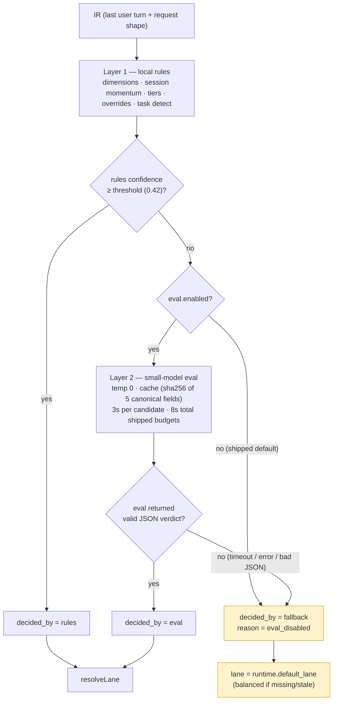

A high-confidence Layer-1 verdict **stops the cascade** — eval is never called,
even when enabled. The eval cache is per-process and only stores *decided*
results, so a transient upstream failure can't be amplified into a 300s outage.
In the current adapter, `rules.enabled` and `eval.cache.enabled` are parsed but
are not runtime off switches: rules always run and Layer-2 always uses its cache
when eval itself is enabled.

---

## 7. Routing & lane resolution

How a request becomes an ordered chain of concrete model aliases. See
[04 Routing & Lanes](04-routing-and-lanes.md). The shipped config has **22 lanes**:
3 quality lanes (`economy`/`balanced`/`premium`), 4 task lanes
(`coding`/`json`/`vision`/`tool_use`), 13 vendor-family lanes that are the
rewrite targets of the model-alias compatibility shim, and 2 image-generation
lanes (`gpt-image`, `gemini-image`).

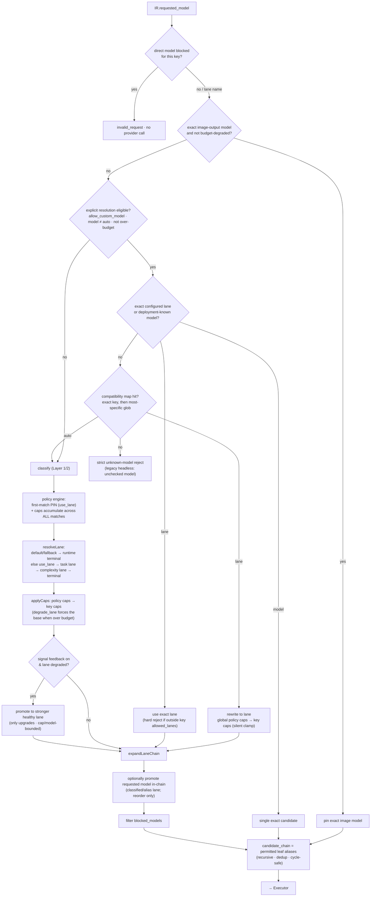

Key subtleties the diagram encodes: exact configured lane/model names are checked
before compatibility mappings, and both forms require `allow_custom_model`;
mapped lanes remain clamped by policy/key `allowed_lanes`. Only the lane *pin* is
first-match while *caps* accumulate across every matching policy; Agentic Signals
can only **upgrade** a degraded ranked lane, never demote. Per-key model patterns
filter concrete expanded aliases, not lane labels. Lane `constraints` are
schema-visible metadata but are not consumed by this plan today; executor
capability gates derive from the request. Requested-model promotion is suppressed
for exact passthrough, alias-to-`auto`, and budget degradation.

---

## 8. Execution — fallback chain + circuit breaker

The executor walks the candidate chain, gating each model through the breaker
and the capability filter. Provider-execution semantics are ported from the
battle-tested `llm-router` (re-implemented, not imported).

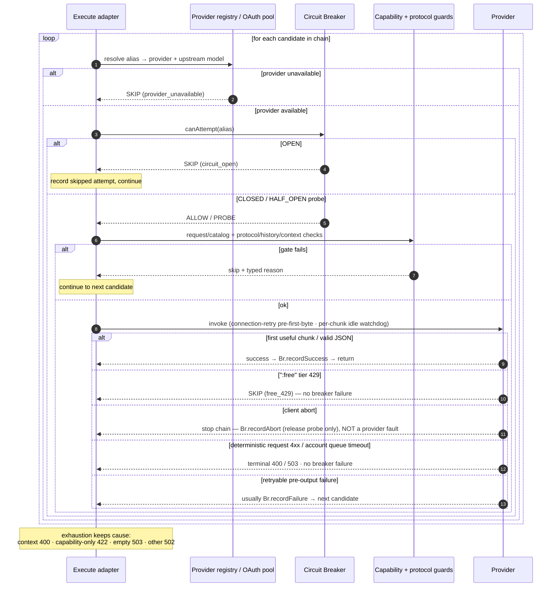

The breaker is per-process and in-memory; its state machine:

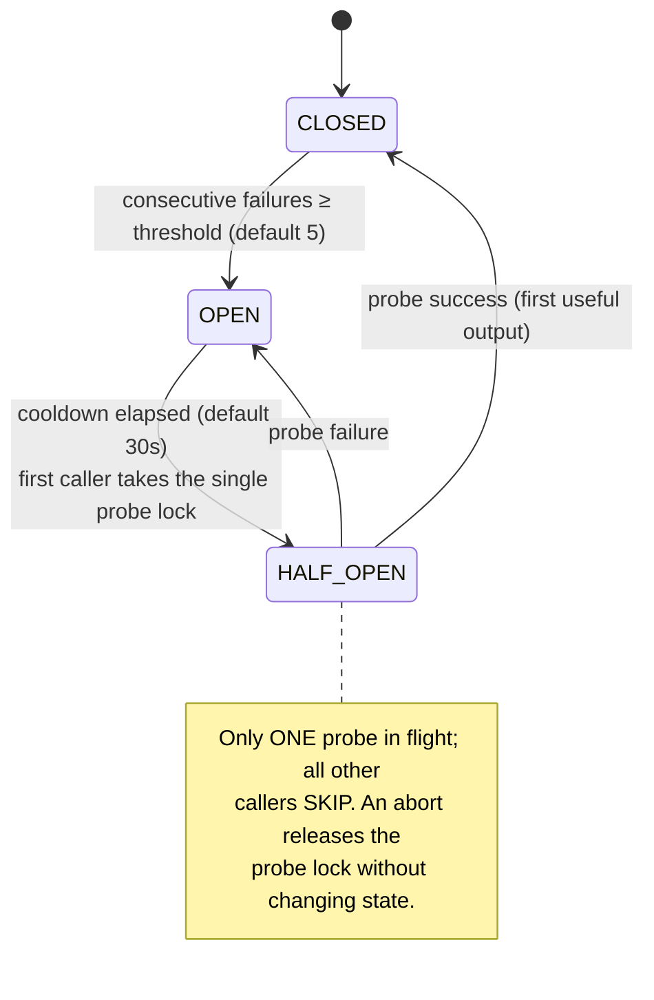

Pre-output guards buffer empty protocol preambles, so breaker success commits on
the first **useful** output rather than a merely syntactic first frame. A stream
that fails after committed output has already healed the breaker, but its later
`stream_outcome` still records incomplete/failed/truncated/client-aborted status.
A client disconnect is never a provider fault—it returns 499, terminates the
chain, and does not trip the breaker. OAuth 401/403/429 faults isolated to one
pooled account also stay off the alias-wide breaker; whole-pool server/transport
failures still count.

---

## 9. Protocol translation & the IR hub

Cross-protocol attempts meet in the IR hub. In addition, Anthropic Messages,
OpenAI Responses, and Gemini requests retain a sanitized native carrier; when a
selected provider speaks the same protocol and the default-on passthrough guard
allows it, the gateway forwards that carrier instead of round-tripping the body
through IR. Routing/governance still use the normalized request. See
[05 Protocol Translation](05-protocol-translation.md).

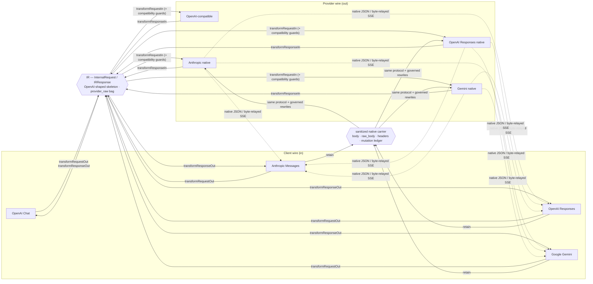

Translated streaming uses explicit per-protocol SSE state machines and terminal
usage handling. Native same-protocol streaming byte-relays upstream frames after
pre-output failure guards decide when output is safe to commit; heartbeat comments
are inserted only at SSE event boundaries. OpenAI Responses also supports an
inbound WebSocket bridge on its creation prefixes, with authenticated session
setup and provider lifecycle handling. Unknown/unsupported translated fields are
carried in `provider_raw` where supported and mutation/data-loss metadata remains
body-free in the decision record.

---

## 10. Memory middleware

Off by default for bootstrap and newly created keys; opt in per key or override
per request with `x-memory-mode: observe|inject`. Two halves: a synchronous
**inject** read on the request path and asynchronous observation/background work.
See [08 Memory Middleware](08-memory-middleware.md)
and [12 Forgetting & Tiering](12-memory-forgetting-and-tiering.md).
After the provider result, outbound assistant/tool content and the served model
are observed through the same deferred queue; `off` performs neither phase.

**Request path — inject (fail-open throughout):**

```mermaid
sequenceDiagram
    autonumber
    participant GW as Gateway
    participant As as assembleInjectedContext
    participant Br as inject-bridge
    participant WQ as writeQueue
    GW->>As: load prior project/resource/thread memory (inject only)
    Note over As: window-aware dedup — drop observations whose<br/>covered turns are all still in the live window
    As->>As: budget-trim (oldest-first, or lowest-score-first if forgetting on)
    As-->>Br: memory block (or null)
    Br->>GW: append ONE trailing user turn (a system-reminder block)
    Note over Br: leading system prompt untouched, prompt cache prefix preserved
    GW->>WQ: enqueue original inbound user/assistant/tool turns
    Note over GW,WQ: inject happens first; observe never stores the injected reminder
```

**Background worker — formation, consolidation, forgetting:**

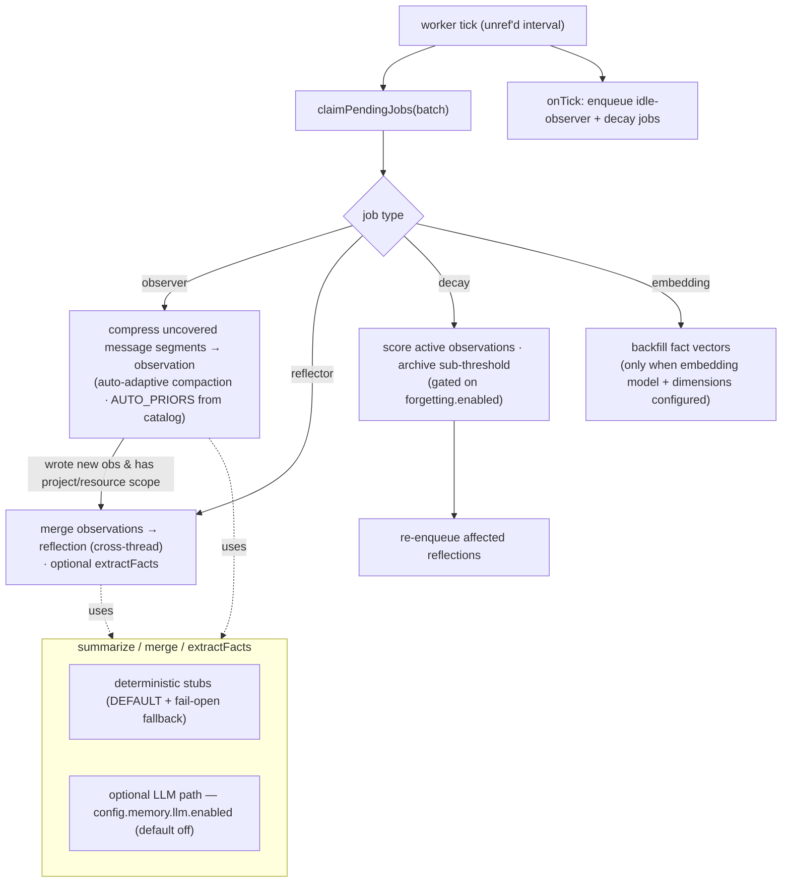

The summarize/merge/fact-extraction steps are injected interfaces. The default
is deterministic concatenate/truncate; an **opt-in** LLM path
(`config.memory.llm.enabled`, default off) routes small-model work back through
Helm and falls back to deterministic output on failure. Idle-flush formation is
independent of forgetting. The checked-in `memory.yaml` enables forgetting and
keyword/score fact retrieval; an absent file uses schema defaults with forgetting
off. Neither setting opts an API key into request memory.

---

## 11. OAuth subscription pool

A provider can authenticate with an OAuth **subscription** instead of a static
key. Built-ins cover Anthropic Claude, GitHub Copilot, ChatGPT Codex, and
experimental xAI SuperGrok. Helm pools several accounts per provider, refreshes
tokens non-interactively, and hot-reloads account settings/model curation. See
[06 Auth](06-auth-and-rate-limits.md).

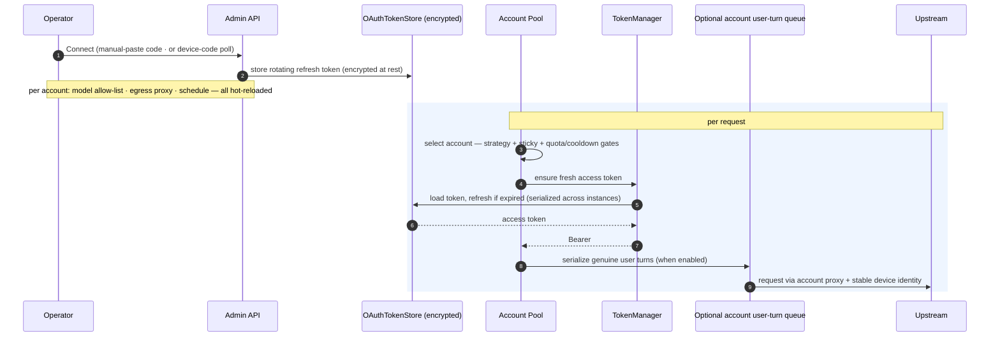

Account selection honors the provider's global strategy (`balanced`,
`manual_priority`, `low_risk`, or `use_expiring`), sticky session keys,
per-account priority, live quota windows, usage-limit cooldowns, and manual
parking. A removed model stops routing immediately (the allow-list is live, not
a display filter). An *unconnected* subscription alias referenced by a lane
**fails open** — Helm skips to the next fallback rather than erroring.
The optional user-turn queue is process-local and keyed by provider/account; a
timeout returns retryable `lane_unavailable` without poisoning breaker health.

> ⚠️ Routing a Claude/ChatGPT/Copilot/xAI subscription through a third-party gateway
> may violate the provider's ToS. Opt-in, self-hosted, your responsibility.

---

## 12. Observability & storage

Every routed generation request yields a redacted `DecisionRecord`; optionally,
the verbatim request/response wire payloads are captured to a **separate** table
for debugging and the editable Retry button. Storage hides behind Store ports so
SQLite and Postgres are interchangeable. See
[07 Observability](07-observability.md).

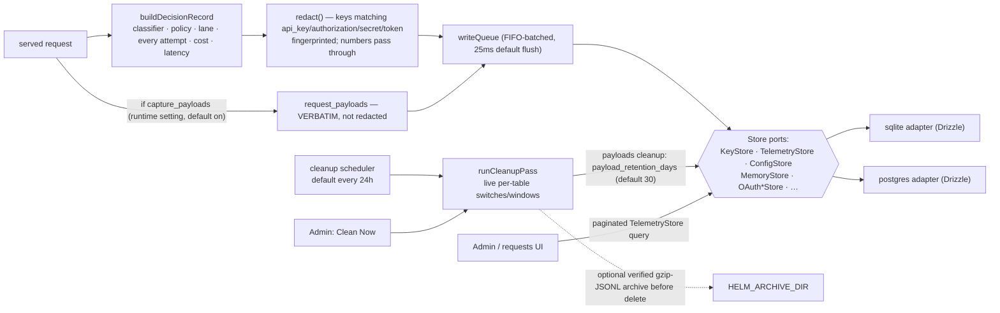

The redacted `DecisionRecord` (no request body) is defense-in-depth: API keys
are stored only as SHA-256 hashes, and the bearer never appears in telemetry or
logs. Full wire request/response bodies live in the payload tables, guarded by a
runtime capture toggle and an independent scheduled retention sweep. Cleanup is
off the request path, runs even when capture is disabled or traffic is idle, and
also covers telemetry, OAuth usage, and completed memory jobs by default; raw and
derived memory cleanup are separate opt-ins. Archival is off by default. One
table's cleanup failure is reported but does not abort the remaining tables.

---

## Where to go next

- Prose architecture & the internal request/decision shapes → [02 Architecture](02-architecture.md)
- The rule engine and eval cache → [03 Classification](03-classification.md)
- Lane/policy semantics and the model-alias shim → [04 Routing & Lanes](04-routing-and-lanes.md)
- SSE event mapping and the IR contract → [05 Protocol Translation](05-protocol-translation.md)
- Keys, caps, OAuth pooling → [06 Auth & Rate Limits](06-auth-and-rate-limits.md)
- Operator management plane → [11 Admin UI](11-admin-ui.md)
- Bearer-key self-service plane → [12 Self-Service Portal](12-self-service-portal.md)
- Account-scoped Memory MCP and Admin memory routes → [13 Memory Admin & MCP](13-memory-admin-and-mcp.md)
- The memory subsystem → [08](08-memory-middleware.md) · [12](12-memory-forgetting-and-tiering.md)
- Deploying it → [10 Deployment](10-deployment.md)
