# Helm API — Architecture & Data Flow

> Visual companion to [02 Architecture](02-architecture.md). That chapter explains
> the system in prose; this one draws it — component map, request lifecycle,
> and a per-stage set of sequence, flow, and state diagrams. Everything here is
> traced to the shipping code; where a stage has its own chapter, it is linked.

Diagrams use [Mermaid](https://mermaid.js.org). GitHub renders them inline; in a
plain editor read the fenced source.

---

## 1. The shape of the system

Helm sits between your applications and every upstream LLM. Clients speak one of
four wire protocols to a single `base_url`; a declarative YAML config decides
which model actually answers; every decision is recorded.

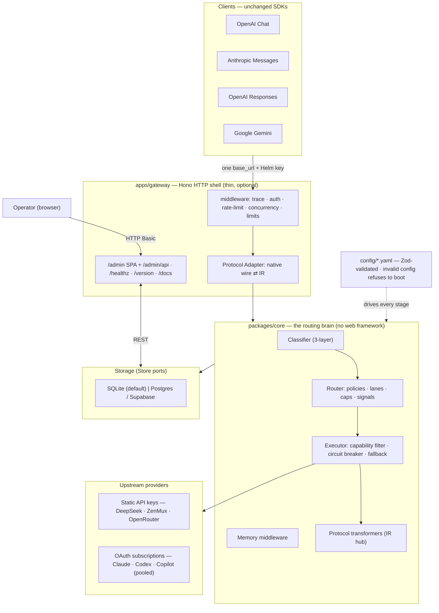

**Reading it:** the gateway is a shell — it normalizes a request into one
*internal representation* (IR) and hands everything else to `core`. The core
never imports Hono or SvelteKit; an architecture test (`packages/core/src/arch.test.ts`)
fails the build if it ever does. That is what makes Helm runnable **headless**.

---

## 2. Module boundaries & the headless-core contract

| Package | Responsibility | Imports a web framework? |
|---|---|---|
| `packages/shared` | Zod schemas → the single source of truth for every type (`z.infer`). Defines the IR, `DecisionRecord`, error model, config schemas. | No |
| `packages/core` | Classification, routing, execution, protocol translation, memory, Store *ports*. Pure logic. | **No (enforced)** |
| `apps/gateway` | Hono: HTTP surfaces, middleware order, protocol ⇄ IR wiring, Store *adapters*, background workers. | Hono |
| `apps/admin` | SvelteKit static SPA. Talks only to `/admin/api/*`; imports **zero** core/gateway code. | SvelteKit |

The dependency arrow only ever points **inward**: `gateway → core → shared`.
The admin SPA depends on neither — it is a pure HTTP client of the admin API.

---

## 3. Request lifecycle — the master path

A single `POST /v1/chat/completions` (or any of the four faces), streaming,
end to end. Optional stages are marked; the colored notes call out each stage's
failure discipline.

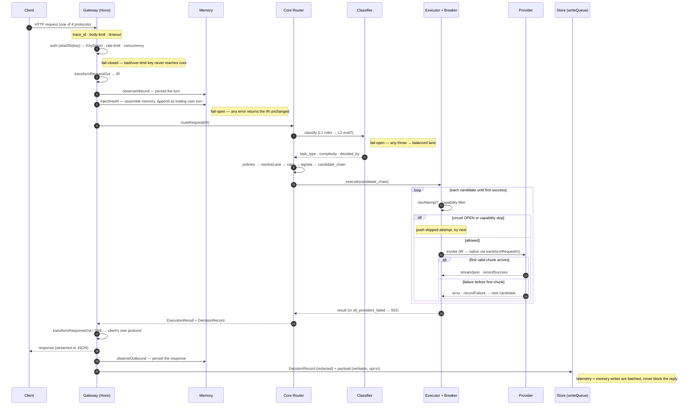

The two memory writes and the telemetry write run **after** the client already
has its answer — they are deferred onto a batched write queue, so observability
never adds latency to the hot path.

---

## 4. Boot — fail-closed configuration

Helm refuses to run half-configured. The whole config tree is parsed and
Zod-validated before the server binds a port.

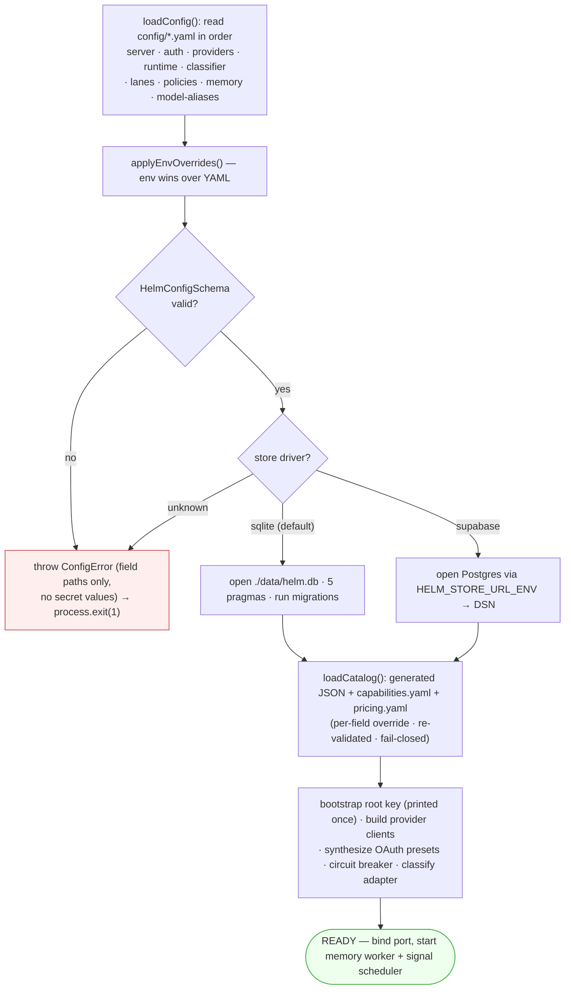

Optional files (`classifier`, `lanes`, `policies`, `memory`, `model-aliases`)
may be **absent** (schema defaults apply) but never **invalid** — a present file
that fails validation still aborts boot. A leftover legacy `observer:` block in
`memory.yaml` is a hard rejection (the schema is `.strict()`), not a silent drop.

---

## 5. The two failure disciplines

Everything in Helm is one of two kinds of component. This single rule explains
almost every design choice.

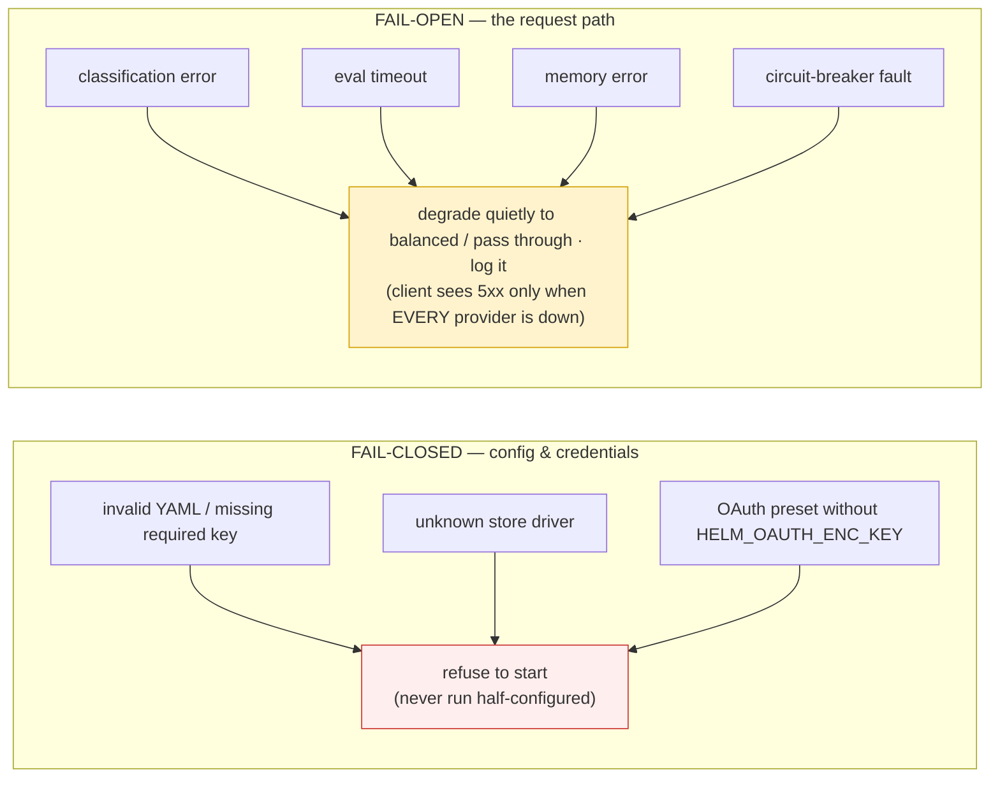

And two *fallbacks* that are deliberately never conflated, with separate
`DecisionRecord` fields so you can always tell which one fired:

- **Classification fallback** — undecided/eval-off → the `balanced` lane
  (`decided_by = fallback`).
- **Execution fallback** — a provider failed → the next model in the chain
  (`fallback_count`, counting only non-skipped attempts).

---

## 6. Classification cascade

Three layers; see [03 Classification](03-classification.md) for the rule engine.
Layer 1 is a pure function (zero network, unit-tested, always on). Layer 2 is an
optional small-model evaluation — `temperature: 0`, cached, **off by default**.
`balanced` is the fail-open sink.

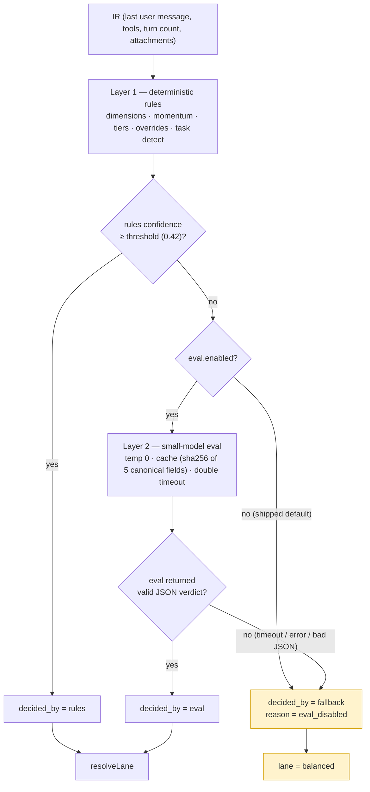

A high-confidence Layer-1 verdict **stops the cascade** — eval is never called,
even when enabled. The eval cache is per-process and only stores *decided*
results, so a transient upstream failure can't be amplified into a 300s outage.

---

## 7. Routing & lane resolution

How a request becomes an ordered chain of concrete model aliases. See
[04 Routing & Lanes](04-routing-and-lanes.md). The shipped config has **22 lanes**:
3 quality lanes (`economy`/`balanced`/`premium`), 4 task lanes
(`coding`/`json`/`vision`/`tool_use`), 13 vendor-family lanes that are the
rewrite targets of the model-alias compatibility shim, and 2 image-generation
lanes (`gpt-image`, `gemini-image`).

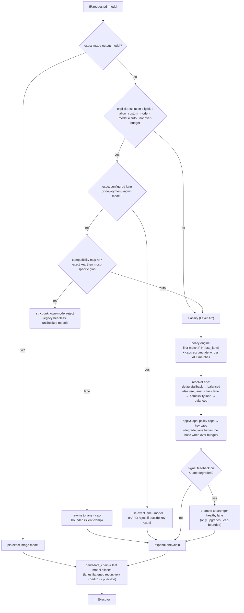

Key subtleties the diagram encodes: exact configured lane/model names are checked
before compatibility mappings, and both forms require `allow_custom_model`;
mapped lanes remain clamped by policy/key `allowed_lanes`. Only the lane *pin* is first-match while
*caps* accumulate across every matching policy; and Agentic Signals can only ever
**upgrade** a degraded lane, never demote.

---

## 8. Execution — fallback chain + circuit breaker

The executor walks the candidate chain, gating each model through the breaker
and the capability filter. Provider-execution semantics are ported from the
battle-tested `llm-router` (re-implemented, not imported).

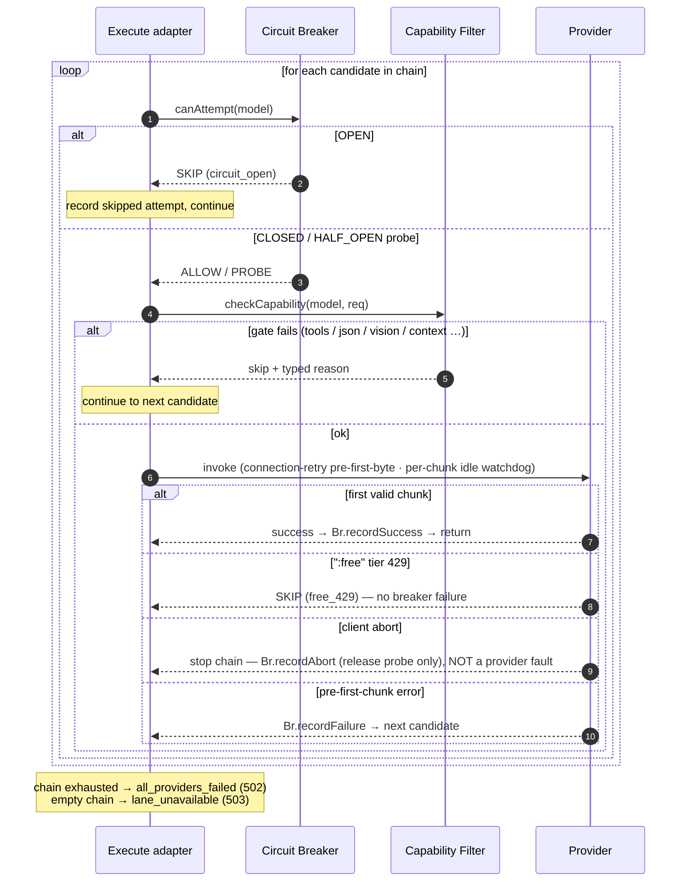

The breaker is per-process and in-memory; its state machine:

Two principles encoded here: **success is recorded at the first valid chunk**
(so a request that streams then dies mid-way still healed the breaker), and a
**client disconnect is never a provider fault** — it returns 499, terminates the
chain, and does not trip the breaker.

---

## 9. Protocol translation & the IR hub

Every protocol meets in the middle. There is no direct A→B path: each side maps
to/from one internal representation, so any client reaches any backend with a
consistent output shape — streaming included. See
[05 Protocol Translation](05-protocol-translation.md).

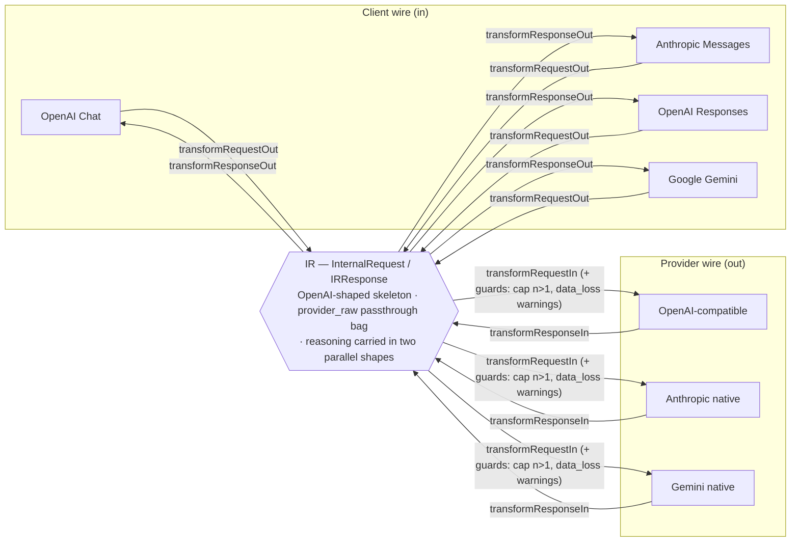

Streaming is **never** raw passthrough: each direction has an explicit per-protocol
SSE state machine, with `safeEnqueue`/`safeClose` guards and usage buffered until
the terminal event. A cache hit or a non-streaming upstream is exploded into a
deterministic SSE byte stream (`synthesizeSSE`) the client can't distinguish from
a live one. Unknown upstream fields ride along losslessly in `provider_raw` and
are stripped from the client-facing body.

---

## 10. Memory middleware

On by default; opt out per key or per request (`x-memory-mode: off`). Two halves:
a synchronous **inject** on the request path, and an asynchronous **background
worker** that compresses and consolidates. See [08 Memory Middleware](08-memory-middleware.md)
and [12 Forgetting & Tiering](12-memory-forgetting-and-tiering.md).

**Request path — inject (fail-open throughout):**

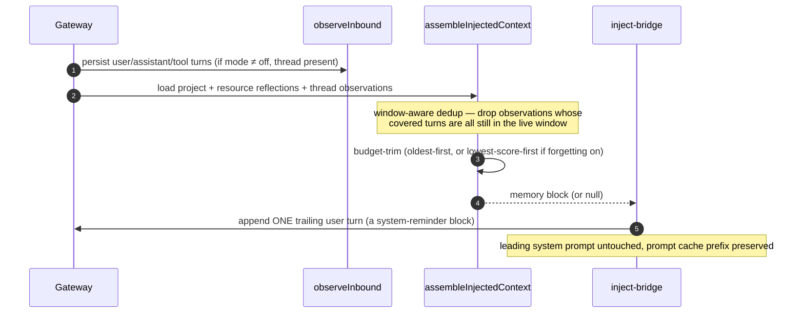

**Background worker — formation, consolidation, forgetting:**

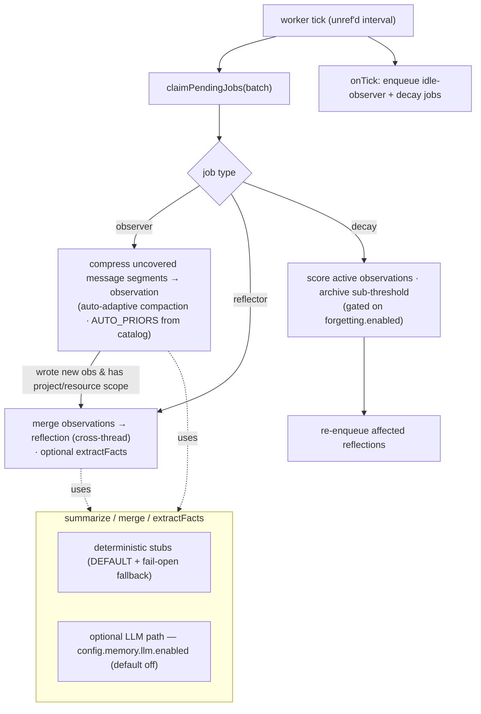

The summarize/merge/fact-extraction steps are injected interfaces. The default
is a deterministic concatenate/truncate; an **opt-in** LLM path
(`config.memory.llm`, default off) calls a small model and falls back to the
deterministic output on any failure. Idle-flush (baseline memory formation) runs
for everyone; only decay and retention are gated behind `forgetting.enabled`.

---

## 11. OAuth subscription pool

A provider can authenticate with an OAuth **subscription** instead of a static
key. Helm pools several accounts per provider, refreshes tokens non-interactively,
and hot-reloads every change. See [06 Auth](06-auth-and-rate-limits.md).

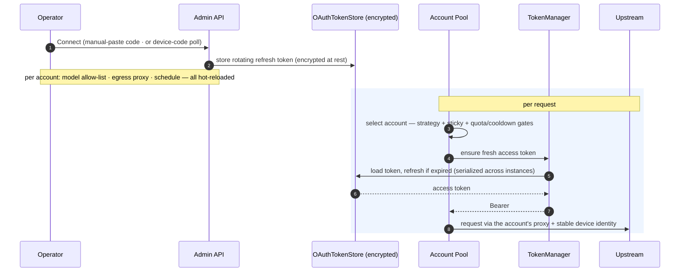

Account selection honors the provider's global strategy (`balanced`,
`manual_priority`, `low_risk`, or `use_expiring`), sticky session keys,
per-account priority, live quota windows, usage-limit cooldowns, and manual
parking. A removed model stops routing immediately (the allow-list is live, not
a display filter). An *unconnected* subscription alias referenced by a lane
**fails open** — Helm skips to the next fallback rather than erroring.

> ⚠️ Routing a Claude/ChatGPT/Copilot subscription through a third-party gateway
> may violate the provider's ToS. Opt-in, self-hosted, your responsibility.

---

## 12. Observability & storage

Every request yields a redacted `DecisionRecord`; optionally, the verbatim
request/response payloads are captured to a **separate** table for debugging and
the editable Retry button. Storage hides behind Store ports so SQLite and
Postgres are interchangeable. See [07 Observability](07-observability.md).

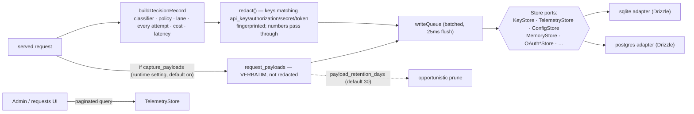

The redacted `DecisionRecord` (no request body) is defense-in-depth: API keys
are stored only as SHA-256 hashes, and the bearer never appears in telemetry or
logs. The verbatim payload table is the one place full bodies live — guarded by
a runtime toggle and an automatic retention sweep.

---

## Where to go next

- Prose architecture & the internal request/decision shapes → [02 Architecture](02-architecture.md)
- The rule engine and eval cache → [03 Classification](03-classification.md)
- Lane/policy semantics and the model-alias shim → [04 Routing & Lanes](04-routing-and-lanes.md)
- SSE event mapping and the IR contract → [05 Protocol Translation](05-protocol-translation.md)
- Keys, caps, OAuth pooling → [06 Auth & Rate Limits](06-auth-and-rate-limits.md)
- The memory subsystem → [08](08-memory-middleware.md) · [12](12-memory-forgetting-and-tiering.md)
- Deploying it → [10 Deployment](10-deployment.md)
