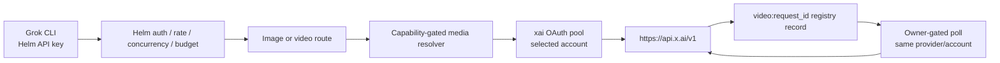

# Grok Imagine 图片与视频支持开发规格

> 状态：**MVP 已实现；发布仍为 No-Go**
>
> 证据基线：2026-08-08 的 `helm-api` 与本机 `grok-build` 源码
>
> 目标：让 Grok CLI 使用 Helm API key，通过 Helm 后台已经连接的 SuperGrok OAuth 订阅池完成图片生成、单图生视频和多参考图生视频。

## 1. 复选框说明

- `[x]`：当前仓库已经实现并有代码/测试证据，或该条明确写的是已经完成的审查与方案决定。
- `[ ]`：尚未实现；只有代码、测试和文档全部合入后才能打勾。
- 本文是开发跟踪文档，不会因为方案已经写出就把待开发项提前标记为完成。

## 2. 范围和完成定义

### 2.1 必须交付

- [x] Helm 已有 `POST /v1/images/generations` 图片入口。
- [x] `grok-imagine-image-quality` 可通过 Helm 已连接的 SuperGrok OAuth 账号生成图片。
- [x] 新增 `POST /v1/videos/generations`，兼容 Grok 的异步视频 start 协议。
- [x] 新增 `GET /v1/videos/{request_id}`，兼容 Grok 的异步视频 poll 协议。
- [x] `grok-imagine-video-1.5-preview` 支持单图生视频。
- [x] `grok-imagine-video` 支持 2–7 张参考图生视频。
- [ ] 使用真实 Grok CLI 验证 `/imagine-video` 默认流程：先生成首帧，再生成视频。
- [x] 图片和视频创建遵守“单写”规则：结果不明时不自动重试、不切 provider、不切 OAuth 账号。
- [x] 视频 poll 始终绑定创建任务时的 Helm owner、provider 和 OAuth account。
- [x] SuperGrok OAuth 图片和视频链路都有离线单测与端到端覆盖。
- [x] OpenAPI、README 与后台模型展示已同步图片/video start/poll 和 SuperGrok OAuth 边界。
- [ ] staging 部署、故障诊断与生产回滚 runbook 同步完成。

### 2.2 完整 Grok Imagine 兼容项

这些能力应全部列入跟踪，但不阻塞第一版“生成图片和生成视频”上线，除非发布范围明确要求完整工具对等。

- [x] `POST /v1/images/edits` 接受 Grok 单图 JSON：`image: { url }`。
- [x] `POST /v1/images/edits` 接受 Grok 多图 JSON：`images: [{ url }]`。
- [x] 图片编辑继续返回 `data[0].b64_json`。
- [ ] 支持视频 ZDR 的 `output.upload_url` 原样透传。
- [ ] ZDR 模式的完成响应允许没有 `video.url`。
- [x] 后台用 Image / Video badge 区分媒体模型与文本模型。
- [x] 后台提供商账号卡片和“管理模型”列表显示三个 Grok Imagine 媒体 alias。
- [x] “发送短消息”的聊天连通性测试排除媒体 alias，服务端也在上游调用前拒绝伪造请求，避免误触发付费媒体生成。

### 2.3 明确不做

- [x] 不把 `/imagine-video` 描述成直接文生视频；当前 Grok CLI 没有 text-to-video tool。
- [x] 不把媒体模型塞进聊天 fallback 链。
- [x] 不把客户端的 `helm_live_*` 透传给 xAI。
- [x] 不让 Helm 下载或代理最终 MP4；正常模式下 Grok CLI 自行读取 xAI 返回的预签名 URL。
- [x] 不在 MVP 新建通用媒体队列、取消 API、长期视频历史页或后台自动 reconcile worker。
- [x] 不伪造 Grok CLI 私有 client/session headers。
- [x] 不凭空编造图片或视频价格。

## 3. 三名专家审查结论

### 3.1 Grok 协议专家

- 媒体基址默认是 `https://api.x.ai/v1`，不是 `cli-chat-proxy.grok.com/v1`。
- `GROK_XAI_API_BASE_URL` 决定 Imagine 请求地址；`GROK_MODELS_BASE_URL` 不参与媒体 URL 选择。
- 图片默认模型完整 ID 是 `grok-imagine-image-quality`；`quality` 是模型名后缀，实际清晰度字段是 `resolution: "1k"`。
- 视频模型不能混用：单图使用 `grok-imagine-video-1.5-preview`，多参考图使用 `grok-imagine-video`。
- video start 返回字段是 `request_id`；poll 只有 `done`、`failed`、`expired` 是已知终态，其他状态继续等待。
- `/imagine-video` 是 `image_gen → image_to_video` 的客户端编排，不是新的 HTTP endpoint。

### 3.2 Helm 架构与安全专家

- 当前图片入口、鉴权、限流、并发、预算、telemetry、payload capture 和 provider client 可以复用。
- 当前 xAI OAuth 只允许 `apiBackend === "responses"`，媒体目录和执行方法均未接通。
- 媒体 create 有付费副作用，不能沿用普通 chat/image fallback 的自动连接重试和 503/529 重试。
- 视频任务必须保存 owner、provider、provider account 和 upstream request ID。
- 未知媒体价格不能被当成 0 美元完成 spend budget 结算。

### 3.3 QA / SRE 专家

- 图片已有 `images.test.ts`、`image-chain.test.ts` 和离线 Playwright 基线，可以扩展而不是重建测试框架。
- 视频需要覆盖 start、poll、跨 key 隔离、OAuth 账号亲和、重启恢复、未知结果和零重复 POST。
- Docker `/healthz` 只证明进程启动，不能代替真实媒体业务 canary。
- 上线前必须用受控测试账号做一次图片和一次视频 canary；开发与 CI 不调用付费 API。

### 3.4 主方案取舍

架构专家建议第一版就增加独立 `MediaTaskStore`。MVP 不采用该方案，原因是现有 `ResponsesRegistryStore` 已经持久化了 `owner account + key + provider + provider account + model + TTL`，足以安全绑定 Grok 的 start/poll 两步协议。

第一版采用：

- 内部 registry key：`video:${upstream_request_id}`；
- 对 Grok CLI 返回上游原始 `request_id`；
- poll 时使用当前 Helm identity 查询带命名空间的 registry 记录；
- 固定回记录中的 provider/account，不重新 pool-select；
- 沿用现有 24 小时 registry TTL。

这个复用方案还必须补两条存储约束：

- 在上游 POST 前先写 `video-create:${helm_request_id}` reservation；如果 reservation 失败，不发送上游请求。
- `video:${upstream_request_id}` 必须 insert-if-absent；发现不同 owner/provider/account 的同名记录时拒绝覆盖，并把本次 create 记为 `outcome_unknown`。

MVP 的 poll ownership 是“同一 account 下的同一把 Helm key”，因为现有 registry 同时校验 `accountId + keyId`。轮转到新 key 后不能接管旧 key 的视频任务；如果产品要求 key rotation 后继续 poll，必须先扩展 ownership 语义，不能绕过现有 key 隔离。

只有出现以下需求时，才升级独立 `MediaTaskStore`：取消、长期历史、后台轮询、人工 reconcile UI、跨多种异步媒体 provider、按任务更新账单。

## 4. Grok CLI 的真实协议

### 4.1 图片生成

请求：

```http
POST {xai_api_base_url}/images/generations
Authorization: Bearer <effective bearer>
Content-Type: application/json
```

```json
{
  "model": "grok-imagine-image-quality",
  "prompt": "...",
  "n": 1,
  "aspect_ratio": "auto",
  "resolution": "1k",
  "response_format": "b64_json"
}
```

成功响应至少包含：

```json
{
  "data": [{ "b64_json": "..." }]
}
```

协议约束：

- [x] 当前 Helm generation schema 是 loose object，`aspect_ratio` 和 `resolution` 会保留。
- [x] 当前 OpenAI-compatible client 会把 JSON 发送至 `${base}/images/generations`。
- [x] 当前图片路由会把 xAI 的 `data[].b64_json` 原样返回。
- [x] Grok 图片 alias、capability、lane、credential 和定向测试已配置。
- [x] xAI 媒体 POST 已禁用自动 transport/overload retry。

Grok 客户端的图片总 timeout 是 300 秒，read timeout 是 240 秒。Helm 的 request timeout 必须允许 operator 为媒体 provider 配置不短于该边界的值，不能继续套用过短的文本请求 timeout。

### 4.2 图片编辑

单图：

```json
{
  "model": "grok-imagine-image-quality",
  "prompt": "...",
  "image": { "url": "data:image/jpeg;base64,..." },
  "n": 1,
  "resolution": "1k",
  "response_format": "b64_json"
}
```

多图：

```json
{
  "model": "grok-imagine-image-quality",
  "prompt": "...",
  "images": [{ "url": "data:image/jpeg;base64,..." }],
  "aspect_ratio": "16:9",
  "n": 1,
  "resolution": "1k",
  "response_format": "b64_json"
}
```

当前 Helm JSON edit schema 只接受 `images[].image_url` 或 `file_id`，因此完整 Grok 图片编辑仍未兼容。实现时应在 shared schema 归一化 Grok 的 `image.url` / `images[].url`，不要在 provider client 内按模型名打补丁。

### 4.3 单图生视频

```http
POST {xai_api_base_url}/videos/generations
```

```json
{
  "model": "grok-imagine-video-1.5-preview",
  "prompt": "short motion description",
  "image": { "url": "https://... 或 data:image/..." },
  "duration": 6,
  "resolution": "480p"
}
```

约束：

- `prompt` 可以是空字符串。
- `duration` 只能是 `6` 或 `10`。
- `resolution` 只能是 `480p` 或 `720p`。
- 该形状不发送 `reference_images`。

### 4.4 多参考图生视频

```json
{
  "model": "grok-imagine-video",
  "prompt": "...",
  "reference_images": [
    { "url": "https://... 或 data:image/..." },
    { "url": "https://... 或 data:image/..." }
  ],
  "aspect_ratio": "16:9",
  "duration": 6,
  "resolution": "480p"
}
```

约束：

- `prompt` 不能为空。
- `reference_images` 数量为 2–7。
- `aspect_ratio` 只能是 `1:1`、`16:9`、`9:16`、`3:2`、`2:3`。
- `duration` 和 `resolution` 与单图模式相同。

### 4.5 视频 start / poll

start 成功：

```json
{ "request_id": "non-empty-upstream-id" }
```

poll：

```http
GET {xai_api_base_url}/videos/{request_id}
Authorization: Bearer <same provider/account credential>
```

```json
{
  "status": "done",
  "video": { "url": "https://temporary-download-url" }
}
```

Grok CLI 每 5 秒 poll 一次，单次 poll timeout 30 秒，总等待 300 秒。poll 接受任意 2xx 以及 202；`done`、`failed`、`expired` 是已知终态，其他状态原样返回并由客户端继续轮询。

正常模式下，`done` 必须带 `video.url`。Grok CLI 下载这个 URL 时不发送 Authorization，Helm 不应代下载、缓存或记录 URL query。

### 4.6 视频 ZDR

开启 ZDR 时，Grok CLI 在 start body 增加：

```json
{
  "output": { "upload_url": "https://presigned-put-url" }
}
```

Grok Build 接受 `http:` 和 `https:` upload URL。Helm 出于生产安全默认只接受 HTTPS；这是一项明确的 Helm 加固策略，不是 Grok 协议限制，测试环境可为 loopback 单独开放 HTTP。

ZDR 放在完整兼容阶段。在 P3 完成 request/upstream/response/error 全链路的 presigned query 脱敏前，严格 video schema 必须拒绝 `output`，不能依赖 loose-object 悄悄透传。Helm 不负责生成 S3 URL。

## 5. 目标架构



框架边界：

- shared：Zod request/response schema 和 `outputVideo` capability。
- core：provider 的图片/视频 wire 调用、错误分类、单写语义；不得 import Hono/SvelteKit。
- gateway：Helm 鉴权、路由、owner 校验、registry 组合、telemetry。
- config：provider alias、lane、能力、价格与 credential env 名称。
- admin：只展示当前可执行的媒体 capability，不参与执行逻辑。

## 6. Provider 与模型目录

### 6.1 SuperGrok OAuth（唯一上游凭证路径）

文本模型仍有两层过滤：解析器只接受 `responses/chat_completions/messages`，执行层又只允许 `apiBackend === "responses"`。媒体模型不经过这条文本 discovery；后台在投影 xAI 账号状态和“管理模型”列表时，显式合并已验证的媒体 allowlist。

不要通过放宽文本模型 parser，把任意未知 `apiBackend` 当成 Responses。媒体模型与聊天目录是两类 capability：

- [x] 保持现有 xAI 文本 discovery fail-closed。
- [x] 为 xAI preset 增加独立、由源码事实校验并签入 config/schema 的媒体模型 allowlist；媒体 alias 仍须同时存在于签入的 capability/config 才可执行。
- [x] 每个已连接且 schedulable 的 xAI account 合成对应 `xai/<media-model>` alias；未知订阅 entitlement 由上游 403/429 权威判定。
- [ ] 已知 Free/X Basic tier 可在后台显示“不支持”；未知 tier 交给上游 403/429 权威判断。
- [x] catalog 为 `xai/grok-imagine-image-quality` 设置 `outputImage: true`。
- [x] catalog 为两个 xAI 视频 alias 设置 `outputVideo: true`。
- [x] 后台模型列表把媒体 alias 标记为 Image / Video，不能显示成 Responses chat model。
- [x] 后台账号状态与“管理模型”的 `available/enabled` 共用媒体 alias 投影，自动/手动模式均与运行时可执行池一致，并保持稳定去重。

### 6.2 Capability schema

- [x] `outputImage` 已存在。
- [x] 新增可选 `outputVideo`。
- [x] resolver 不得把输入能力 `modalities: ["video"]` 当作视频生成能力。
- [x] 缺少明确 capability 的模型 fail-closed，不尝试上游。

## 7. ProviderClient 与 OAuth pool

### 7.1 ProviderClient

- [x] 已有 `imageGeneration` 和 `imageEdit`。
- [x] 增加 `videoGeneration(body, options)`。
- [x] 增加 `videoRetrieve(requestId, options)`。
- [x] `videoRetrieve` 对 path segment 使用安全编码。
- [x] start 校验非空 `request_id`。
- [x] poll 校验 `status` 是字符串；未知状态保留。
- [x] 2xx/202 成功响应原样返回，不擅自改名为 Helm 自定义状态。

### 7.2 单写请求

现有 OpenAI client 会对连接错误以及 503/529 重发 POST；现有 image chain 也可能尝试下一个 provider。这对有副作用的媒体生成不安全。

- [x] 图片 generation/edit 和视频 start 使用无自动重试的 media write helper。
- [x] 请求发出前的本地失败可以选择别的候选：schema、credential、capability、blocked model、budget、concurrency。
- [x] 视频 start 在上游 POST 前持久化 `video-create:${helm_request_id}` reservation；reservation 失败时零上游调用。
- [x] 一旦开始上游 POST，timeout、disconnect、不可解析的成功响应或无法确认的 5xx 统一记为 `outcome_unknown`。
- [x] `outcome_unknown` 不重发 POST，不换 provider，不换 OAuth account。
- [x] 已收到 upstream `request_id` 但 owner/provider/account registry 映射写入失败，同样返回 `outcome_unknown`，绝不返回会诱导客户端重试的普通失败。
- [x] registry 映射成功后的 telemetry 辅助写入仍按 Helm 原则 fail-open；记录告警但不把已可安全 poll 的任务改成失败。
- [x] 返回结构化错误和 Helm request ID，供 operator 查询 telemetry；没有 upstream `request_id` 时不伪造可轮询任务。
- [x] 只有上游将来提供并经测试验证幂等键，才允许使用同一幂等键重试。

### 7.3 OAuth media client

文本继续走 `cli-chat-proxy.grok.com`；媒体必须使用同一个 token manager 构造 `https://api.x.ai/v1` client。

- [x] xAI account client 合并媒体 client 的 image/video 方法。
- [x] `serialize-client` 保留这些可选方法和 protocol profile。
- [x] OAuth pool 的媒体 create 只选择一次账号。
- [x] pool 捕获并返回实际 serving account，供 registry 和 telemetry 使用。
- [x] media create 的 ambiguous failure 不尝试 sibling account。
- [x] video poll 按 registry 的 `providerAccount` 定向调用，不参与 round-robin。
- [x] 原账号失效时返回可诊断错误，不换账号查询别人的任务。

## 8. Gateway 路由与任务归属

### 8.1 图片

- [x] Helm key 鉴权。
- [x] rate limit、concurrency、blocked model、request memory admission。
- [x] `outputImage` capability gate。
- [x] 图片 payload/telemetry 基线。
- [x] dynamic `xai/*` OAuth image alias 可解析。
- [x] OAuth serving account 写入 image decision 和 subscription usage。
- [x] Grok media 单写错误不会进入现有 image fallback。

### 8.2 视频 start

- [x] 注册 `POST /v1/videos/generations`。
- [x] 复用图片入口的 auth、rate、concurrency、blocked model、memory admission 和 budget gate。
- [x] 用严格 Zod schema 校验 image/reference_images、duration、resolution、aspect ratio；当前阶段明确拒绝 ZDR `output`。
- [x] resolver 只接受 `outputVideo: true` 的 target。
- [x] upstream 成功后校验非空 `request_id`。
- [x] 用 insert-if-absent 写入内部 `video:${request_id}` registry 记录，禁止覆盖不同 owner/provider/account 的已有行。
- [x] registry 保存 Helm account/key、provider name/alias/model、provider account、创建时间、24h 失效时间和状态。
- [x] 对客户端返回上游原始 start JSON。

### 8.3 视频 poll

- [x] 注册 `GET /v1/videos/:requestId`。
- [x] 使用当前 Helm identity 查询 `video:${requestId}`。
- [x] 未找到、过期、跨 account 或不是同一把 Helm key 一律返回 404，避免泄漏任务是否存在。
- [x] 根据记录定位原 provider 和 OAuth account。
- [x] poll 绕过 model fallback 和新账号选择。
- [x] poll 不重复做生成预算结算。
- [x] 上游 2xx/202 JSON 原样返回。
- [x] `done/failed/expired` 更新 registry 状态；未知状态保持非终态。
- [ ] poll transport error 可以安全重试 GET，但必须有次数、timeout 和 abort 上限。

## 9. 鉴权边界

正确链路：

```text
Grok CLI 的 helm_live_*  → 只鉴权 Helm
Helm 存储的 OAuth token  → 鉴权对应 SuperGrok account 的 api.x.ai 媒体请求
```

后台「连接客户端 → Grok Build」现会生成以下三项。变量名 `XAI_API_KEY` 是 Grok CLI
的客户端读取约定；这里的值必须是 Helm key，不是官方 xAI key：

```bash
export GROK_MODELS_BASE_URL="https://<helm>/v1"
export GROK_XAI_API_BASE_URL="https://<helm>/v1"
export XAI_API_KEY="helm_live_..."
```

`GROK_MODELS_BASE_URL` 只控制模型发现，Imagine 只读取 `GROK_XAI_API_BASE_URL`。
如果 Grok 登录 session 在运行时把 Authorization 替换成用户 xAI bearer，同一个 header
就无法再携带 Helm key；当前链路必须让发给 Helm 的 effective key 保持为 `helm_live_*`。
未来如要同时保持 Grok session 和 Helm 代理鉴权，须由 Grok CLI 增加独立代理鉴权头，
Helm 不会把任意 xAI bearer 当成自己的 API key。

- [x] Helm provider client 会用服务端 credential 生成上游 Authorization。
- [x] Grok CLI 配置文档明确要求 `GROK_XAI_API_BASE_URL=https://<helm>/v1`。
- [x] 客户端的 effective API key 必须是 Helm key。
- [x] 文档明确 `GROK_MODELS_BASE_URL` 不控制 Imagine 地址。
- [x] 文档说明：Grok session 模式的动态 xAI OAuth bearer 会覆盖客户端配置的 Helm key；仅修改 Helm 无法同时从同一个 Authorization 头获得 Helm key 和用户 xAI token。
- [x] 如将来必须支持“保持 Grok 登录会话再走 Helm”，应在 Grok CLI 增加独立代理鉴权头；Helm 不接受任意 xAI bearer 作为自身 API key。

## 10. 预算、计价、遥测和正文

### 10.1 预算与价格

- [x] 图片入口已有 request/token/spend budget gate。
- [x] 成功的媒体 create 只结算一个 request；poll 不计为新生成请求；结果不明的请求仍以 telemetry/reservation 防重复，不伪造成功消费。
- [ ] 上游有 authoritative billed cost 时优先使用。
- [x] 没有可信成本时记录 `cost_usd: null`，不能记录 0。
- [x] API key 配置了美元 spend cap 且无法在创建前给出可信上限时，fail-closed 返回 `media_pricing_unavailable`。
- [x] 只有 request-count cap、没有 spend cap 时，可允许 unpriced subscription media，并保留 `cost_usd: null`。
- [x] 若以后支持按 duration/resolution 计价，再扩展 pricing schema；第一版不把视频价格伪装成 token price。

### 10.2 遥测

- [x] image decision 写入最终 provider/account/model、latency、cost 和 outcome。
- [x] video start 写入同样字段及 upstream request ID 的 SHA-256 脱敏引用。
- [x] poll 记录结构化生命周期日志，但不把每 5 秒 poll 计作一次消费。
- [ ] 监控 `outcome_unknown`、create timeout/5xx、401 refresh、429、poll age、终态延迟和跨账号阻止次数。
- [x] bearer、data URL、完整 base64、presigned URL query 不进入常规日志和 DecisionRecord。
- [x] 扩展 payload blob externalizer，覆盖 `image.url`、`reference_images[].url` 的 data URL。
- [x] request、upstream request、response 和 error body 全部删除 presigned URL query。
- [x] payload capture 默认关闭；开启时才允许沿用扩展后的大对象外置与 retention 机制。

## 11. 配置和文件改动清单

### 11.1 Shared

- [x] 新增 `packages/shared/src/request/videos-schema.ts`。
- [x] 从 `packages/shared/src/index.ts` 导出 video schema/type。
- [x] 在 catalog capability schema 增加 `outputVideo?: boolean`。
- [x] 扩展 image edit schema，兼容 Grok JSON carrier（完整对等阶段）。

### 11.2 Core

- [x] 扩展 `ProviderClient` 的 video start/poll 方法。
- [x] OpenAI-compatible client 增加 `/videos/generations` 和 `/videos/{id}`。
- [x] 增加不重试的 media write 路径及 `outcome_unknown` 错误分类。
- [x] `serialize-client` 透传 media 方法。
- [x] OAuth pool 增加 media create 与 pinned retrieve。
- [x] `ResponsesRegistryStore` 增加 insert-if-absent reservation/mapping 能力，SQLite/Postgres 合同一致。
- [x] 补齐 provider、OAuth pool 和 catalog 单测。

### 11.3 Gateway

- [x] 新增 `apps/gateway/src/routes/videos.ts`。
- [x] 没有新增独立 `video-chain.ts`：单写和 owner binding 直接复用现有 provider/pool/registry 纯逻辑，未复制一套抽象。
- [x] 在 `server.ts` 组合 SuperGrok OAuth media client、resolver 和 registry。
- [x] 扩展 image resolver 支持动态 xAI OAuth alias。
- [x] 扩展 image telemetry 的 serving account。
- [x] OpenAPI 增加 video start/poll。

### 11.4 Config / Admin / Docs / Deployment

- [x] providers、capabilities、pricing、lanes 增加 xAI media 配置。
- [x] Admin provider/model 页面显示 Image/Video capability 和可用账号。
- [x] README / README.zh-CN 已补齐 Grok 图片、视频 start/poll、单写与 OAuth-only 边界。
- [ ] 01、04、05、06、07、09、10、11 的 staging 部署、故障诊断与生产回滚边界更新。
- [x] 根目录 `implementation-notes.md` 记录 spec 未覆盖决定、偏差和限制。

## 12. TDD 测试计划

所有生产代码必须遵守 Red → Green → Refactor。先写最小失败测试并确认失败原因，再写实现。

### 12.1 Provider 单测

- [x] 扩展 `packages/core/src/provider/openai.images.test.ts`：Grok generation body原样转发。
- [x] 验证 xAI media POST 遇到 transport error、503、529 都不会自动重发。
- [x] 在 provider 媒体定向测试中覆盖 video start URL/body/auth/response。
- [x] 验证 poll URL 安全编码、2xx/202、错误 scrub 和 timeout。

### 12.2 OAuth 单测

- [x] `serialize-client.test.ts`：image/video 方法不丢失。
- [x] `pool.test.ts`：create 只选一个账号。
- [x] `pool.test.ts`：ambiguous create 不换 sibling。
- [x] `pool.test.ts`：poll 固定原账号；原账号失效时不换账号。
- [x] `server.oauth.test.ts`：同一 credential 的文本去 proxy、媒体去 `api.x.ai`。
- [x] `server.oauth.test.ts`：媒体 alias/account 展示与 entitlement 边界。

### 12.3 Gateway 单测

- [x] 扩展 `images.test.ts`：Grok OAuth generation、serving account、single write。
- [x] 新增 `videos-schema.test.ts`：单图、多图、边界和拒绝路径。
- [x] 新增 `videos.test.ts`：auth、blocked model、budget、concurrency、start/poll。
- [x] 同 key 可 poll；不同 key、不同 Helm account 均不能 poll。
- [x] 过期记录由复用的 registry owner/TTL 合同拒绝。
- [x] 进程重建后可从 store 恢复视频绑定。
- [x] reservation/store 写失败时 upstream create 次数分别为 0/1，且不会自动重试。
- [x] 相同 upstream ID 的跨 owner/provider 冲突 fail-closed，不覆盖旧记录。
- [x] start unknown 不重复 POST。
- [x] poll 未知状态不误判终态。
- [x] 同 account 换成另一把 Helm key 后仍不能 poll 旧任务。
- [x] Grok video data URL 被外置，presigned query 在四类捕获正文中都被删除。
- [x] OpenAPI/catalog/config fail-closed 测试。

### 12.4 离线 e2e

- [x] 扩展 `e2e/fixtures/mock-upstream.ts` 支持 Grok image 和 video 状态序列。
- [x] 离线 e2e 覆盖 Grok 图片真实 gateway journey。
- [x] OAuth 图片和账号归因已合并进 `e2e/videos.spec.ts` 的同一离线媒体 journey，避免重复启动 fixture。
- [x] 新增 `e2e/videos.spec.ts`：start → pending/unknown status → done。
- [x] 两个 Helm key 的任务严格隔离。
- [x] 两个 OAuth account 时 poll 始终回创建账号。
- [x] 重启 gateway 后使用原 request ID 继续 poll，绝不重新 start。

### 12.5 定向命令

迭代期只运行相关文件：

```bash
CI=true pnpm exec vitest run packages/core/src/provider/openai.images.test.ts
CI=true pnpm exec vitest run packages/core/src/provider/oauth/serialize-client.test.ts packages/core/src/provider/oauth/pool.test.ts
CI=true pnpm exec vitest run apps/gateway/src/routes/images.test.ts apps/gateway/src/routes/videos.test.ts apps/gateway/src/routes/openapi.test.ts
CI=true pnpm exec vitest run apps/gateway/src/server.oauth.test.ts
CI=true pnpm --filter @helm/gateway exec playwright test e2e/images.spec.ts e2e/videos.spec.ts
```

候选发布先运行完整代码测试门禁：

```bash
CI=true pnpm typecheck
CI=true pnpm lint
CI=true pnpm build
CI=true pnpm test:ci:fast
CI=true pnpm test:ci:store
CI=true pnpm test:e2e
```

随后必须等待 GitHub CI 独立 `docker` job 全绿。该 job 需要构建镜像并验证 `/healthz`、`/version`；媒体业务正确性由离线 OAuth mock e2e 和受控 staging canary 证明。仅运行上面的 pnpm 命令不等于 Docker 交付完成。

## 13. 分阶段实施

### P0：冻结协议和失败语义

- [x] Grok 源码协议已完成只读核对。
- [x] Helm 当前能力与 OAuth 过滤链已完成只读核对。
- [x] 三角色方案审查完成。
- [x] 为本文建立实现分支并按 TDD 开始开发。
- [x] 将单写、unknown、owner/account binding 写成失败测试。

### P1：SuperGrok OAuth 图片生成

- [x] 独立媒体 alias/catalog projection。
- [x] OAuth account media client 和 pool 透传。
- [x] dynamic image resolver 与 serving-account telemetry。
- [x] 图片 media write 禁止自动 retry/fallback。
- [x] OAuth image unit/e2e 通过。
- [x] 使用本机测试 SuperGrok 账号完成受控图片 canary（HTTP 200，未重试媒体 POST）。

### P2：SuperGrok OAuth 视频生成

- [x] video schema、ProviderClient、route、resolver。
- [x] registry owner/provider/account binding。
- [x] create reservation、insert-if-absent 冲突和 registry 写失败语义。
- [x] 单图与多参考图协议。
- [x] video data URL 外置与 capture/error 脱敏。
- [x] OAuth video unit/e2e 通过。
- [x] 使用本机测试 SuperGrok 账号完成受控视频 canary（start HTTP 200，poll 到 `done`，未重试媒体 POST）。

### P3：完整对等与发布

- [x] Grok JSON image edit。
- [ ] ZDR passthrough、HTTPS production policy 与四类正文脱敏。
- [x] Admin media badges/account visibility。
- [ ] OpenAPI、用户文档、部署/回滚 runbook。
- [ ] 完整 CI、Docker、单副本低并发 canary 全绿。

## 14. Go / No-Go

### Go 条件

- [ ] 所有“必须交付”复选框完成。
- [ ] focused unit/e2e 与完整 CI 全绿。
- [ ] GitHub CI 的独立 Docker job 全绿。
- [x] media create 的重复 POST 测试证明次数恒为 1。
- [x] 跨 key、跨 Helm account、OAuth account 固定和重启恢复全部通过。
- [x] `outcome_unknown` 可从 Helm request ID 查到，但不会触发重试。
- [x] spend budget 在未知价格时不会被当成 0 绕过。
- [ ] 使用测试账号完成一次图片和一次视频 staging canary。
- [ ] 生产发布锁定完整 SHA image digest，并准备回滚版本。

### No-Go 排除检查

这些验证未完成或发现反例时一律 No-Go：

- [x] 已验证 create timeout/断线后不会自动重试或 fallback。
- [x] 已验证 poll 不会重新选择 OAuth account。
- [x] 已验证第二把 Helm key 无法读取第一把 key 的视频任务。
- [x] 已验证 registry 冲突和落库失败不会覆盖旧任务或诱导重复 create。
- [x] 已验证后台展示的每个媒体模型都有可执行 client 方法。
- [x] 已验证未知媒体费用不会被写成 0 并绕过 spend cap。
- [x] 已验证日志、telemetry 和默认 payload 路径不泄漏 bearer、data URL、base64 或 presigned query。
- [x] 已完成本机真实媒体 journey canary，而不只是 `/healthz`；staging canary 仍是独立 Go 门禁。

## 15. 发布与回滚

- [ ] 首次发布只启用单 replica、低并发测试 key。
- [ ] 观察至少一个完整视频 poll SLA 窗口后再扩大。
- [ ] dashboard 按 provider/model/account 展示 create、unknown、429/401、poll age、terminal latency。
- [ ] 回滚前 drain 旧实例，保留 registry、telemetry、payload 和 config。
- [ ] 对已提交或结果不明的任务只读 reconcile，绝不因回滚重新 start。
- [ ] 使用完整 SHA digest 回滚，不使用 `latest`。

## 16. 主要源码证据

Grok Build：

- 图片模型与协议：`crates/codegen/xai-grok-tools/src/implementations/grok_build/image_gen/mod.rs`
- 图片编辑：`crates/codegen/xai-grok-tools/src/implementations/grok_build/image_edit/mod.rs`
- 视频 start/poll/ZDR：`crates/codegen/xai-grok-tools/src/implementations/grok_build/video_gen/mod.rs`
- `/imagine-video` 组合：`crates/codegen/xai-grok-tools-api/src/slash_commands.rs`
- media base URL 与鉴权装配：`crates/codegen/xai-grok-shell/src/agent/mvp_agent/agent_ops.rs`

Helm：

- 图片 request schema：`packages/shared/src/request/images-schema.ts`
- catalog capability/pricing：`packages/shared/src/catalog/schema.ts`
- OpenAI-compatible provider client：`packages/core/src/provider/openai.ts`
- xAI model parser/filter：`packages/core/src/provider/oauth/models.ts`
- OAuth pool：`packages/core/src/provider/oauth/pool.ts`
- registry port：`packages/core/src/store/ports.ts`
- 图片 route/chain/telemetry：`apps/gateway/src/routes/images.ts`、`image-chain.ts`、`image-telemetry.ts`
- runtime composition：`apps/gateway/src/server.ts`
- admin xAI discovery projection：`apps/gateway/src/oauth/admin-oauth.ts`
