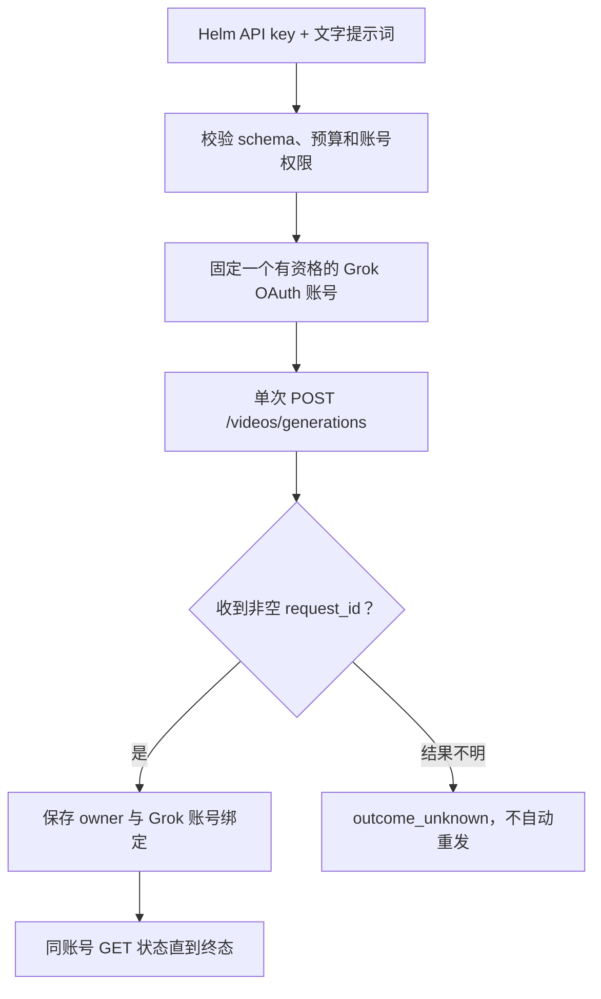

# Grok.com Imagine OAuth 图片与视频能力开发规格

> 状态：**已批准开发，正在实施**（用户于 2026-08-18 批准）
>
> 唯一目标：用户把 Grok 订阅账号通过 OAuth 接入 Helm 后，Helm API 能使用该账号在 `grok.com/imagine` 网页端实际拥有的图片和视频生成能力。
>
> 唯一验收源：当前 Grok.com 网页协议、账号 entitlement 与真实任务回读。Sub2API、Grok Build、官方 xAI API 只作实现参考。

本文使用复选框跟踪开发。只有实现、最低成本有效测试和对应验收证据全部完成后，才能把 `- [ ]` 改为 `- [x]`。

当前分支存在一批**未提交的试验代码**，用于验证 Sub2API 路线能否接入 Helm。方案现已批准，但这些代码仍不自动算作开发完成；必须逐项对照本文保留、修改或撤销，并在最低成本有效测试通过后才能勾选功能项。

相关文档：

- [既有 Grok Imagine 媒体规格](grok-imagine-media-spec.md)：Helm 当前图片、图生视频、单写和任务归属基线。
- [认证、API Key 与限流](06-auth-and-rate-limits.md)：OAuth、quota、预算和鉴权边界。
- [错误模型](07-error-model.md)：结构化错误与协议翻译。

## 1. 先用大白话说清楚要做什么

### 1.1 我现在理解的目标

你要的不是“让 Grok Build 多一个命令”，也不是“接官方 xAI API key”。你要的是：

1. 用户在 Helm 后台授权自己的 Grok 订阅账号。
2. 调用方只拿 Helm API key，不接触 Grok OAuth bearer。
3. 调用方可以通过 Helm 的 API 使用该订阅账号在 Grok 网页版实际拥有的图片生成和文字生成视频能力。
4. Helm 根据每个 Grok 账号的真实权限选账号；免费、过期或权限不明的账号不能被拿去做媒体生成。
5. 图片直接返回结果；视频先返回任务号，再用同一个 Helm key 轮询，且始终回到创建任务的那个 Grok 账号。

一句话概括：**把 Helm 做成 Grok 网页版 Imagine 能力的安全 API 中转层，而不是自己实现图片或视频生成算法。**

### 1.2 第一阶段怎么做

第一阶段采用“复用 Helm 现有链路，只补缺口”的路线：

- OAuth 登录、token 加密保存和多账号池继续用 Helm 现有代码。
- 图片继续走现有 `POST /v1/images/generations`，补齐 Grok 网页版使用的快速/质量模型和严格参数。
- 文字视频参考 Sub2API：把 `model + prompt` 作为一次视频创建请求发到 xAI 媒体接口；拿到非空 `request_id` 后，继续复用 Helm 已有的视频任务绑定和轮询。
- 不把 Grok Build 的“先生成图片，再图生视频”当成默认路线。那是 Grok Build 客户端自己的两步编排，与 Sub2API 的单次文字视频请求不是一回事。
- Sub2API 的本地 mock 只能证明“请求怎么转发”，不能证明当前 SuperGrok OAuth 在线上一定接受所有参数。因此功能在真实受控 canary 成功前仍是 No-Go。

### 1.3 这次不做什么

- 不复制 Sub2API 的用户、充值、计费、套餐销售和整套网关代码。
- 不把任意请求体完全透传；Helm 仍使用严格 Zod schema，避免未知字段和误付费。
- 不新增第二套 OAuth、账号池、图片 provider 或视频任务系统。
- 不自动重试可能已经收费的图片/视频创建请求。
- 不用本地 FFmpeg 拼接冒充 Grok 原生长视频。

### 1.4 现有能力与本阶段开发边界

“已经能连接订阅账号”不等于“已经识别了账号的媒体权限”。本阶段严格按下表复用或补齐：

| 能力 | 已合并基线 | 本阶段处理 |
|---|---|---|
| Grok OAuth 登录、刷新和加密保存 token | 已有 | 直接复用，不重做 |
| 多账号池、优先级、代理和可调度开关 | 已有 | 直接复用 |
| 7 天 quota 读取和后台展示 | 已有 | 作为证据输入之一，不直接等同于媒体权限 |
| 按账号判断是否可做媒体生成 | 不完整；连接账号会投影固定媒体 allowlist | 补 fresh/unknown/ineligible gate，媒体权限失败不影响普通 Grok 文本 |
| 按套餐判断每个图片/视频选项 | 没有可靠能力源 | P1 找到真实网页/上游证据后再开放，不按套餐名猜测 |
| 图片 generation 路由、鉴权、预算和单写保护 | 已有 | 原地扩展，不新建第二套图片链路 |
| `grok-imagine-image-quality` 质量模型 | 已有 | 保持兼容并做真实回读 |
| `grok-imagine-image` 快速模型 | 已合并基线没有 | 补模型 allowlist、capability、lane、严格测试和 canary |
| 图片数量、宽高比、resolution 等字段 | 部分字段可宽松透传，但不是正式网页合同 | 收紧成已证实枚举、默认值和账号能力过滤 |
| 单图/多参考图生视频 | 已有 | 保持兼容 |
| 纯 `model + prompt` 文字视频 | 已合并基线没有 | 参考 Sub2API 增加单次 create 合同 |
| 视频 receipt、owner/account 绑定和固定账号 poll | 已有 | 直接复用并补 prompt-only 回归 |

因此，PR 1 不是“重新做账号权限系统”，而是：**在现有 OAuth、quota 和账号池之上补媒体 entitlement 筛选层。**PR 2 也不是重写图片生成，而是：**扩展现有 Helm 图片链路以覆盖 Grok.com 已确认的图片模式和选项。**

## 2. 产品范围

### 2.1 要交付的能力

图片生成：

- 用户只输入文字即可生成图片。
- 使用当前网页提供的速度/质量模式。
- 支持网页当前允许的生成数量和宽高比。
- 返回可直接被客户端消费的图片结果。

视频生成：

- 用户只输入文字即可发起视频生成，不要求调用方手工准备首帧。
- 支持网页当前允许的时长、分辨率、宽高比和音频开关。
- 返回任务 receipt，并允许客户端轮询到成功/失败终态及取得视频结果。

账号能力：

- 每个 OAuth 账号只开放其当前套餐实际拥有的选项。
- 同一套餐名称不硬编码永久能力；以上游 entitlement/能力回读为准。
- 媒体任务始终绑定实际执行它的 OAuth 账号。

### 2.2 当前只读观察

2026-08-18 在已登录的 `grok.com/imagine` 页面只读确认：

- [x] 图片模式提供速度、质量 v2.0、默认一次四张和宽高比。
- [x] 视频模式接受纯文字提示词。
- [x] 视频页面显示 480p、720p、1080p。
- [x] 视频页面显示 6s、10s、15s。
- [x] 视频页面提供宽高比和 Video audio 开关。
- [x] 页面还提供上传/编辑入口，但不属于本阶段目标。
- [x] 本次观察没有提交生成，没有消耗账号额度。

网页控件只能证明产品能力存在，不能单独证明底层 endpoint、请求字段或生成步骤。

## 3. 证据边界与实现路线

### 3.1 四个证据来源分别能证明什么

| 来源 | 能证明 | 不能证明 |
|---|---|---|
| Grok.com 网页 | 用户实际可见能力、账号级选项、最终产品行为 | 未抓到请求前不能确定 transport/schema |
| Sub2API | 已实现的媒体路由、entitlement、模型映射、计费和账号绑定思路 | route/mock 存在不等于 Grok.com OAuth 真实成功 |
| Grok Build | 当前 CLI 的 `image_gen → image_to_video` 工作流和底层媒体 payload | CLI 工作流不等于网页内部实现 |
| Helm 当前代码 | 已有图片、图生视频、单写、owner/account registry | 已合并基线不支持 prompt-only 视频，也未覆盖全部网页选项 |

已经完成的源码分析：

- [x] Sub2API 的 prompt-only 请求为 `{"model":"grok-imagine-video","prompt":"..."}`。
- [x] Sub2API 对该请求只调用一次 `POST https://api.x.ai/v1/videos/generations`，不会自动先生成图片。
- [x] Sub2API 主要提供媒体路由、账号 eligibility、模型映射、任务绑定和计费；生成能力仍来自 Grok 上游。
- [x] Sub2API 的相关自动测试使用 mock upstream，只能证明 URL、请求体、模型映射和任务号提取。
- [x] 使用受控 Grok 订阅账号确认 prompt-only 请求在线上被接受并最终生成视频。

### 3.2 第一阶段 transport 决策

第一阶段先按 Sub2API 已实现的单次视频创建合同开发，但把真实 canary 作为上线门禁：



- [x] 确认 Sub2API prompt-only 视频的 endpoint、请求体和任务号提取逻辑。
- [x] 确认 Sub2API 不在 Helm/Sub2API 本地执行“文字→图片→视频”编排。
- [x] 只读定位或通过受控 canary 确认 Grok.com 当前图片响应和结果载体。
- [x] 只读定位或通过受控 canary 确认视频 start、poll 和最终结果形状。
- [ ] 确认网页选项来自账号 entitlement、远端 feature flag 还是固定枚举。
- [x] 确认请求需要的非敏感 client-version/header 语义；文档不记录 cookie、bearer、账号 ID 或签名 URL。
- [x] 将证据记录为 endpoint/字段/状态的脱敏摘要，不保存网页正文或账号关联数据。

若只读证据仍不足，可以完成严格的离线转发合同，但必须保持发布 No-Go，等待用户批准一次受控 canary；不能根据 Sub2API mock 或 Grok Build CLI 宣称线上已经可用。

## 4. 第一阶段完成定义

### 4.1 P0：最小真实闭环

- [x] OAuth 连接完成后，Helm 能获得并持久化该账号的新鲜媒体 entitlement/能力快照。
- [x] 未知、过期或明确无权限的账号不进入媒体 create 账号池；普通 Grok 文本请求不受影响。
- [x] `POST /v1/images/generations` 使用当前 Grok.com 图片 transport 完成一次默认图片生成。
- [x] `POST /v1/videos/generations` 接受纯文字并使用当前 Grok.com 视频 transport 完成一次默认视频创建。
- [x] 图片成功必须有至少一个有效图片结果；视频成功必须有非空任务 receipt。
- [x] 视频 receipt 返回客户端前，先持久化 Helm account/key/provider/OAuth account 绑定。
- [x] `GET /v1/videos/:request_id` 固定原 OAuth 账号轮询到终态；跨 owner 查询返回 404。
- [x] SQLite 与 Postgres/Supabase 重启后均能恢复 entitlement 和在途视频绑定。
- [x] 两类付费 create 的模糊结果均为 `outcome_unknown`，不自动重试、换账号或重放。
- [x] bearer、cookie、完整 prompt、图片/视频正文和签名 URL 不进入常规日志或 `DecisionRecord`。

P0 使用网页当前默认值；默认值必须从已确认协议/配置取得，不在代码里猜测。

### 4.2 P1：补齐网页当前图片选项

- [x] 图片速度模式端到端成功。
- [ ] 图片质量 v2.0 模式端到端成功。
- [ ] 网页允许的生成数量全部进入严格 schema，并按实际账号能力过滤。
- [ ] 网页允许的宽高比全部进入严格 schema，并按实际账号能力过滤。
- [x] 每个已标记成功的选项都有实际 serving account、entitlement 和结果回读证据。

### 4.3 P1：补齐网页当前视频选项

- [ ] 6s、10s、15s 分别按网页协议开放；账号不具备的时长在本地确定性拒绝。
- [ ] 480p、720p、1080p 分别按网页协议开放；账号不具备的分辨率在本地确定性拒绝。
- [ ] 网页允许的宽高比全部进入严格 schema。
- [ ] Video audio 开关按网页协议开放，默认行为与网页一致。
- [ ] 每个选项只在真实任务取得 receipt、原账号 poll 到有效终态后勾选。

### 4.4 明确不包含

- [x] 不克隆 Grok.com 网页 UI；Helm 继续提供 headless API。
- [x] 不做图片编辑、上传模板、视频 edit/extension、取消、长历史页或通用媒体队列。
- [x] 不把本地 FFmpeg 拼接/循环当作 Grok.com 原生长视频。
- [x] 不把官方 xAI API-key 文档当作 Grok.com 订阅 OAuth 合同。
- [x] 不在运行时抓网页、下载 CLI 或自动修改协议配置。

## 5. Helm API 合同

### 5.1 保持现有入口

不新增重复 API：

```http
POST /v1/images/generations
POST /v1/videos/generations
GET  /v1/videos/:request_id
```

- [x] 图片请求使用共享 Zod schema；Grok.com 专有选项只在 xAI OAuth 分支严格校验。
- [x] 视频 schema 新增严格的 prompt-only 形状：最小请求只要求 `model + prompt`，已确认的网页选项才加入枚举。
- [x] 现有单图/多参考图视频合同保持兼容。
- [x] 不把 provider 内部 model/endpoint 暴露为新的公共市场；公开参数表达用户可理解的模式和选项。

### 5.2 账号能力投影

P0 不急着新建一套 entitlement 数据库。先复用 Helm 已有的 OAuth quota snapshot 和账号模型过滤，表达最小的账号级媒体开关：

```ts
interface GrokImagineEntitlement {
  account: string;
  tierHint: string | null;
  mediaCreate: "unknown" | "eligible" | "ineligible";
  evidenceSource: "billing" | "upstream" | "unknown";
  observedAtMs: number;
  validUntilMs: number;
}
```

- [x] 优先复用现有 quota Store；只有现有结构无法表达可信证据时才新增 Store/migration。
- [x] JWT/tier 不能单独授权；当前实现要求“新鲜 billing 正证 + 明确已知付费 tier”同时成立，opaque、缺失、未知、Free/X Basic 均 fail-closed。
- [x] 正向授权设置明确 TTL，取 `capturedAt + 24h` 与周窗口 reset 的较早者；账号池选择、图片/视频 resolver 和 `/v1/models` 均动态重评估。
- [x] capability 只允许进一步收窄账号池；手工模型配置不能绕过 entitlement。
- [x] `/v1/models` 只声明当前至少一个 OAuth 账号真正可执行的媒体能力。

P1 找到可靠的网页选项能力源后，再增加图片模式、数量、宽高比，以及视频时长、分辨率、宽高比和音频等细粒度字段；P0 不凭套餐名称猜整张能力表。

## 6. 安全与错误不变量

| 场景 | 客户端结果 | 上游付费写 | 行为 |
|---|---|---:|---|
| schema/key/model/capability/预算拒绝 | 400/401/422/429 | 0 | 确定性拒绝 |
| entitlement unknown/stale/ineligible | 403/503 | 0 | 显式 refresh 后重评估 |
| 上游 400/401/403/422/429 | 对应结构化错误 | 1 | 更新正确的 schema/credential/entitlement/quota 域 |
| timeout/断连/模糊 5xx | `503 outcome_unknown` | 1 | 禁止重放 |
| 图片为空或视频 receipt 为空 | `503 outcome_unknown` | 1 | 禁止重放 |
| 视频 receipt 绑定失败 | `503 outcome_unknown` | 1 | 不向客户端确认成功 |
| status owner 不匹配或过期 | 404 | 0 | 不泄露存在性 |

- [ ] 客户端断连不算 provider 故障，但付费 POST 发出后仍尽力读取并保存 receipt。
- [x] create 请求一旦可能被上游接受，就不进入普通 provider/account fallback。
- [x] status 是只读操作，可有有界 GET 重试，但始终固定原 OAuth 账号。
- [ ] 403、429、426、invalid_grant 分别更新 entitlement、quota、client-version、credential 域。

## 7. 三角色专家评审后的统一结论

### 7.1 OAuth / 安全架构

- entitlement 必须是账号级、可过期、可回读的事实，不能由套餐名永久推断。
- 仅有“7 天窗口”还不够；必须同时确认明确已知付费 tier，并给正向证据设置较短 TTL；opaque、缺失、未知、Free/X Basic 均 fail-closed。
- entitlement refresh 失败时，内存中的旧媒体 alias 也必须立即关闭，不能只删除数据库记录。
- 真实任务固定执行账号；付费写的模糊结果不重放。
- 如果网页是多步生成，必须另有幂等、部分成功和分阶段 receipt；如果网页是单次创建，则不建 workflow。

### 7.2 图片/视频 Provider

- 第一阶段采用 Sub2API 的 prompt-only 单次 POST 合同，复用 Helm 现有 client、resolver 和 registry。
- 保留严格 schema，不照搬 Sub2API 的任意 body 透传。
- Grok Build 的两步工具保留为不同客户端工作流，不混入第一阶段的原生文字视频接口。
- 只增加真实网页闭环需要的方法，不补完整媒体 API 市场。

### 7.3 QA / SRE

- mock 只能证明本地 schema、映射、调用次数和 owner 隔离。
- 业务完成必须有真实图片结果，或视频 receipt + 原账号终态结果。
- `/healthz`、CI 绿色、HTTP 2xx、网页按钮存在都不能单独作为业务验收。

### 7.4 实施中复审结论（2026-08-18）

- [x] OAuth 安全复审指出的动态过期已修复：媒体模型在运行中的账号池内按 `validUntilMs` 自动失效，普通 Grok 文本保持可用。
- [x] OAuth 安全复审指出的 discovery 漂移已修复：entitlement 失效后 concrete alias 与仅指向该 alias 的媒体 lane 都从 `/v1/models` 隐藏。
- [x] OAuth 安全复审指出的撤权失败已修复：旧 entitlement 删除失败时，无条件关闭 live xAI 媒体 alias，不能由普通 rebuild 重新授权。
- [x] OAuth 安全复审指出的未知 tier 已修复：fresh billing 不能与 opaque/缺失/未知 tier 组合成媒体正向授权。
- [x] Provider 复审指出的纯空白图片载体已修复：空白 `b64_json` / `url` 返回 `outcome_unknown`，且付费 POST 仍只有一次。
- [ ] Provider 复审指出的细粒度能力仍未完成：默认 fast 图片已有真实账号证据；quality、数量、宽高比、6/10/15s、480p/720p/1080p、audio 仍没有逐项账号级证据，不能勾选对应 P1。

## 8. TDD 与交付顺序

严格按 P0 → P1，先红后绿。

### 8.1 PR 1：媒体 entitlement 筛选层（复用现有 OAuth）

- [x] 先写失败测试：eligible/ineligible/unknown/stale、Free/X Basic 不授权、混合账号池只选择 eligible 账号。
- [x] 复用现有 quota snapshot；正向证据设置 TTL，读失败和空数据都 fail-closed。
- [x] 显式 refresh 更新 entitlement；refresh 失败同时撤销 durable 和 live 媒体权限。
- [x] 普通 Grok 文本模型不依赖媒体 entitlement，不能被误伤。
- [x] focused tests、typecheck、lint、build 和完整 CI 已在本机 Docker 隔离环境按 `.github/workflows/ci.yml` 等价复刻并全绿；远端 GitHub Actions 留待提交 PR 后复验。

### 8.2 PR 2：扩展现有 Helm 图片链路

- [x] 先写失败测试：默认图片、速度/质量、数量、宽高比、空结果和付费单写。
- [x] 复用现有图片 handler/resolver/provider，不创建第二套 transport。
- [x] 更新 OpenAPI、Admin 能力显示和媒体 telemetry。
- [x] 真实 canary 已获批并回读默认 fast 图片成功；其他选项仍逐项保持未勾选。

### 8.3 PR 3：网页文本视频能力

- [x] 先写失败测试：只有 `model + prompt` 的最小请求、网页选项、receipt、owner/account 绑定和 status。
- [x] 复用现有 `POST /v1/videos/generations` 单次 transport，不新增两步 workflow。
- [ ] 覆盖 6/10/15s、480/720/1080p、宽高比、audio 的 capability gate。
- [x] 覆盖所有付费失败路径的上游写次数为 0 或 1。
- [x] 真实 prompt-only canary 已获批、取得 receipt，并由原账号 poll 到 `done`；细粒度选项仍逐项保持未勾选。

建议定向测试，文件名按实际最小实现调整：

```bash
CI=true pnpm exec vitest run packages/core/src/provider/oauth/xai-quota.test.ts
CI=true pnpm exec vitest run packages/core/src/provider/oauth/pool.test.ts
CI=true pnpm exec vitest run packages/shared/src/request/images-schema.test.ts packages/shared/src/request/videos-schema.test.ts
CI=true pnpm exec vitest run apps/gateway/src/routes/images.test.ts apps/gateway/src/routes/videos.test.ts
CI=true pnpm --filter @helm/gateway exec playwright test e2e/videos.spec.ts
```

## 9. Canary 与发布门禁

### 9.1 Canary 前置条件

- [x] 用户已允许使用本机 Docker 中已绑定的 SuperGrok 账号进行测试。
- [x] 在首次付费请求前确认本轮最大写入次数；上限为 2 次：1 次默认图片 create + 1 次默认文字视频 create，视频后续只做 GET poll。
- [ ] 测试账号 entitlement 新鲜；Helm key 有低 request/concurrency/budget cap。
- [x] 测试环境单副本，部署 image digest 和 `/version` SHA 已锁定并可回滚。
- [x] 每项能力只测试一次；无 receipt 的 timeout/断线/5xx 只对账，不重发。

### 9.2 本机 Docker 测试基线

2026-08-18 已完成不消耗额度的只读检查：

- [x] 容器名 `helm`，镜像 `ghcr.io/easymetaau/helm-api:latest`，端口 `8080`。
- [x] Docker health 为 healthy；`GET /healthz` 返回 `ready: true` 且 Store 正常。
- [x] `GET /version` 返回版本 `0.28.74`、Git SHA `cfb80d3c6e6b1747d7f4167adb5a43598adbe3bf`、构建时间 `2026-08-15T16:32:34Z`。
- [x] 该容器是已发布基线，不包含当前工作区未提交的试验代码。
- [x] 用户确认后台已绑定 SuperGrok 账号；文档不记录账号标签、OAuth token 或 Helm key。

`/healthz` 和截图只证明服务及账号连接状态，不证明图片/视频业务成功。真实验收仍以图片结果、视频非空 receipt、固定原账号 poll 终态和服务端归属回读为准。

### 9.2.1 真实受控 canary（2026-08-18）

- [x] 候选镜像 `sha256:2940600c…` 以单副本运行；`/version` 回读 `0.28.74-phase1-local` 与 `cfb80d3c…-dirty`，旧 v0.28.74 容器保留为停止态回滚点。
- [x] 正式 refresh 链取得新鲜 `7d` billing 窗口并热重建媒体池；`/v1/models` 与 Admin 模型目录都只显示一个真实 serving account 可执行的四个 Imagine alias。
- [x] 默认 `grok-imagine-image` 只发出一次 create，返回 1 个非空图片结果；telemetry 的 serving provider 为 xAI，serving account 能回连当前 OAuth 绑定。
- [x] 默认 `grok-imagine-video` 只发出一次纯文字 create，取得非空 receipt；同一 Helm key 经 6 次只读 GET，由创建账号固定轮询到 `done` 并取得非空视频结果。
- [x] registry 终态为 `done`，active key、provider 与 OAuth account 绑定完整；entitlement、telemetry、registry 和实际结果一致。
- [x] 容器普通日志中 Helm key、Bearer、两条 canary prompt 均为 0 次出现；`DecisionRecord` 中两条 prompt 均不存在。文档不记录 receipt、账号标识、媒体正文或签名 URL。
- [x] 新增默认跳过的 `apps/gateway/src/live-grok-imagine.test.ts`；只有显式确认“恰好两次媒体 create”并通过环境变量提供 Helm key 时才运行，响应输出不包含 key、prompt、receipt、媒体正文或签名 URL。
- [x] 用户于同日要求再次调用 Helm API 验证；该 live smoke 额外执行 1 次默认图片 create 和 1 次纯文字视频 create，均未重试。图片取得可读结果；视频取得 receipt 后经 5 次只读 GET 到 `done`，并验证视频结果可读取。
- [ ] 首次 canary 与同日 live smoke 都沿用现有 recovery key；该 key 没有低 request/concurrency/budget cap，因此 9.1 的组合前置条件仍不勾选。两次获批执行各自由硬闸门限制为 1 次图片 create + 1 次视频 create，四次 create 均未重试。

### 9.2.2 完整 CI 本机等价验证（2026-08-18）

- [x] `verify`：`pnpm typecheck`、`pnpm lint`、`pnpm build` 均通过；`pnpm test:ci:fast` 为 355 个测试文件、6417 个用例全绿。
- [x] `store`：`pnpm test:ci:store` 为 60 个测试文件、650 个用例全绿。
- [x] `e2e`：使用隔离的 PostgreSQL 17 + pgvector 与本地 mock upstream，真实 PostgreSQL 合约和完整 Playwright 套件共 95 项全绿；没有调用任何付费媒体接口。
- [x] `docker`：正式多阶段镜像构建成功，镜像为 `sha256:fbfa07f3…`；随机宿主端口映射到容器 `8080` 后，`/healthz` 回读 `ready: true`，`/version` 回读 `0.28.74` 与非 `unknown` Git SHA。
- [x] CI 隔离数据库、网络、浏览器缓存和 smoke 容器均已清理；正在运行的 `helm` 候选容器未停止、未重启、未替换。
- [x] 正式 PR #761 已创建；实现提交 `29ff7655` 的托管 GitHub Actions run `32142663949` 中，`PR / verify`、`PR / store`、`PR / e2e`、`PR / docker` 均已回读为成功。本轮不合并或部署。

### 9.3 Go / No-Go

- [x] P0 全部复选框完成，focused tests 与完整 CI 已在本机 Docker 隔离环境全绿。
- [x] 图片默认流程返回有效图片并回读实际 OAuth 账号。
- [x] 文字视频默认流程返回非空 receipt，并由原 OAuth 账号 poll 到有效终态。
- [x] entitlement、serving account、registry 和 telemetry 四处证据一致。
- [x] unknown、跨 owner 隔离和重启恢复均有离线证据。
- [x] bearer、cookie、prompt、媒体正文和签名 URL 未进入常规日志/DecisionRecord。
- [ ] 回滚只关闭新 capability/transport，保留已接受视频的 registry 与 poll。

任一 P0 条件未满足即 No-Go。某个 P1 选项失败只保持该选项关闭，不阻断其他已验证能力。

## 10. 主要源码证据

Helm：

- 当前图片 schema：`packages/shared/src/request/images-schema.ts`。
- 当前视频 strict union：`packages/shared/src/request/videos-schema.ts`。
- 视频单写、receipt 绑定和 status：`apps/gateway/src/routes/videos.ts`。
- 图片路由和 provider chain：`apps/gateway/src/routes/images.ts`、`apps/gateway/src/routes/image-chain.ts`。

参考项目：

- Sub2API 媒体入口、entitlement 与转发：`/Users/luke/websites/jsdev/sub2api/backend/internal/handler/grok_media.go`、`backend/internal/service/grok_media.go`、`backend/internal/service/account.go`。
- Grok Build 两步视频工具：`/Users/luke/websites/grok-build/crates/codegen/xai-grok-tools-api/src/slash_commands.rs`、`xai-grok-tools/src/implementations/grok_build/video_gen/mod.rs`。

实现与发布时必须重新核对 Grok.com 当前协议、账号 entitlement、部署 SHA 和受控 canary 结果。
