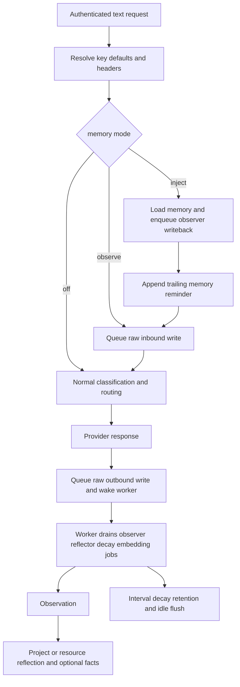

# Memory Module Review (2026-06-20)

> Historical bug-cluster review, re-audited against current source on
> 2026-07-16. The incident observations below describe June 2026 snapshots; the
> “Current” sections describe the present implementation. Use docs 08, 12, 13,
> and 14 as the maintained contracts.

## Current pipeline

Memory has one raw layer and three derived artifacts:

| Artifact | Scope | Current purpose |
|---|---|---|
| Raw messages | thread | Idempotent user/assistant/tool transcript for audit, coverage, and background formation. |
| Observations | thread | Compressed, time-anchored, ranged summaries. |
| Reflections | project/resource/thread | Versioned long-form summaries; normal inject reads project/resource slots. |
| Facts | project/resource/thread | Atomic durable claims with dedup, temporal supersede, optional static inject, and MCP search/recall. |

Authenticated API keys default memory mode to `off`. When a key opts into
`inject`, the request path loads memory before persisting the current turn,
appends one trailing `<system-reminder>` block, then continues through normal
classification/routing. Observe writes are queued fail-open; expensive formation
runs in `memory_jobs`.



Important current correction: pure `observe` does not directly enqueue an
observer job. It persists raw turns; the interval idle-flush sweep later enqueues
quiet threads with uncovered history. `inject` does enqueue observer write-back.

## Current formation behavior

The Observer compacts a contiguous uncovered segment when any current trigger
applies:

- size (default 2048 tokens);
- thread context pressure (default 80% of resolved context);
- idleness (default one hour).

It derives policy inputs from the served model, catalog pricing/context, active
prior observations, and measured retention. Raw rows survive compaction.

The gateway summarizer includes user-authored content only. LLM summarize/merge
and observation-fact extraction are implemented behind `memory.llm.enabled`; the
deterministic paths remain runtime fallbacks. Raw eager facts deliberately fall
back to an empty list rather than deterministic prose extraction.

Short durable statements can bypass compaction through
`forgetting.consolidate.eager_facts`, but all three gates must be true:

```text
memory.llm.enabled
memory.forgetting.enabled
memory.forgetting.consolidate.eager_facts
```

The schema rejects invalid combinations. The eager Observer path mines uncovered
user turns only, retries one empty result once, persists through a receiver-bound
`insertFactsReconciled.call(memoryStore, ...)`, and rechecks for user turns that
arrived after the running job's snapshot.

## Current forgetting and retention behavior

The checked-in `config/memory.yaml` currently sets:

```text
forgetting.enabled = true
facts_retrieval.enabled = true
score.half_life_s = 86400
decay.archive_threshold = 0.05
consolidate.trigger_tokens = 1024
consolidate.max_facts_per_subject = 8
consolidate.enable_llm_supersede = false
retention.archived_days = 30
retention.facts_expired_days = 90
```

`eager_facts` is omitted and therefore false. `llm.enabled` and `mcp.enabled`
are also false unless an operator adds them. The forgetting config does not
override per-key `memory_mode=off`.

Deletion semantics:

- decay soft-archives low-score observations;
- automatic retention tombstones aged archived observations to `pruned` and
  `[pruned]`, preserving the row/range as coverage;
- automatic retention hard-deletes aged expired facts;
- automatic forgetting never hard-deletes reflections;
- fact Admin/MCP delete soft-prunes;
- reflection Admin/MCP delete is two-stage: archive active, then permanently
  purge an already archived scope on a second delete;
- raw-message cleanup is a separate cleanup subsystem, not forgetting retention.

## June 2026 bug cluster

The original review grouped several failures that made “remember this” behavior
look unreliable. Their current source status is:

| Historical problem | Current status |
|---|---|
| Live `eager_facts` was disabled, so short turns had no fast path. | Feature is explicit and cross-gated; checked-in config still leaves it off by default. |
| An aggressively short live half-life decayed memory too quickly. | Score knobs are strict config; checked-in half-life is 86400 seconds. Live operator config must still be inspected separately. |
| The fact LLM sometimes returned a bare array while the parser expected `{facts:[...]}`. | `coerceFactsEnvelope` now accepts and normalizes both shapes. |
| Gemini native passthrough did not append memory. | `appendMemoryToGeminiBody` is wired in the shared messages pipeline and covered by native-inject tests. |
| Resurrecting a fact kept stale project/resource/thread scope. | Both adapters reactivate and overwrite scope from the new ingest before superseding siblings. |
| Eager extraction detached `insertFactsReconciled`, losing `this.db`. | Current Observer invokes the method with `.call(deps.memoryStore, ...)`; regression tests use the real adapter behavior. |
| A user turn could arrive after a running Observer's snapshot and coalesce into that already-running job. | Completion recheck enqueues a fresh observer job only when a new user message id appeared. |
| Empty eager extraction was difficult to distinguish from a path that never ran. | Empty first result now logs retry; final empty/no-user/missing-dependency branches are still partly silent. |

## Review lessons

1. **Follow the entire formation chain.** Raw writes prove observe works; they do
   not prove observations, facts, or reflections are advancing.
2. **Separate config gates.** Key request mode, forgetting, LLM memory, eager
   facts, fact retrieval, and MCP are independent switches.
3. **Compare write and read scope.** A fact can exist but remain invisible when
   owner/project/resource/thread filters differ.
4. **Test real method binding.** Closure-only fakes can hide detached class-method
   failures.
5. **Preserve coverage while forgetting content.** Observation tombstones stop
   old raw ranges from resurfacing.
6. **Treat reflections as derived cache.** Decay must rebuild/archive them after
   observation visibility changes.
7. **Distinguish static injection from deep recall.** `eager_facts` controls the
   known-fact block; `memory_recall` is an MCP query tool.

## Operational guidance

When `/admin/memory` appears stalled, compare all of these rather than checking
only facts/reflections:

- effective API-key `memory_mode`, project, and thread-source settings;
- raw `memory_messages` / thread activity;
- `memory_jobs` pending/running/done/failed by type;
- stale running jobs (five-minute lease);
- observations and their active/archived/pruned state;
- active facts and active reflections;
- worker logs for idle-flush, observer, reflector, decay, and embedding;
- live `config/memory.yaml`, especially whether
  `idle_flush_max_age_s > idle_flush_s` when both are set.

The Admin endpoint `GET /admin/api/memory/stats` provides body-free storage,
queue, stale-lease, and activity counters and is cached for ten seconds. It is a
better first probe than a broad scan of a large SQLite memory table.

Use `idle_flush_max_age_s` to bound cold backfill on an old database. If it is
less than or equal to `idle_flush_s`, the candidate time window can be empty;
that is a configuration stall, not proof that observe writes are broken.

## Current known gaps

- static injected facts are not reinforced;
- `facts_injected` is not persisted in the request decision;
- raw eager extraction has no persistent scan watermark and some no-op exits are
  silent;
- dedicated memory cost sinks are wired to no-ops;
- manual fact changes do not immediately enqueue embedding work;
- no raw/observation content management surface exists.

## Current source map

- request scope: `apps/gateway/src/routes/memory-scope.ts`
- observe: `packages/core/src/memory/observe.ts`
- inject: `packages/core/src/memory/inject.ts` and `inject-bridge.ts`
- native bodies: `apps/gateway/src/routes/native-memory-inject.ts`
- Observer/Reflector: `packages/core/src/memory/observer.ts`, `reflector.ts`
- worker: `packages/core/src/memory/scheduler.ts`
- memory LLM/embedder: `apps/gateway/src/memory-llm.ts`, `memory-embedder.ts`
- stores: `packages/core/src/store/{sqlite,postgres}/memory-store.ts`
- config: `packages/shared/src/config/memory-schema.ts` and
  `config/memory.yaml`.
