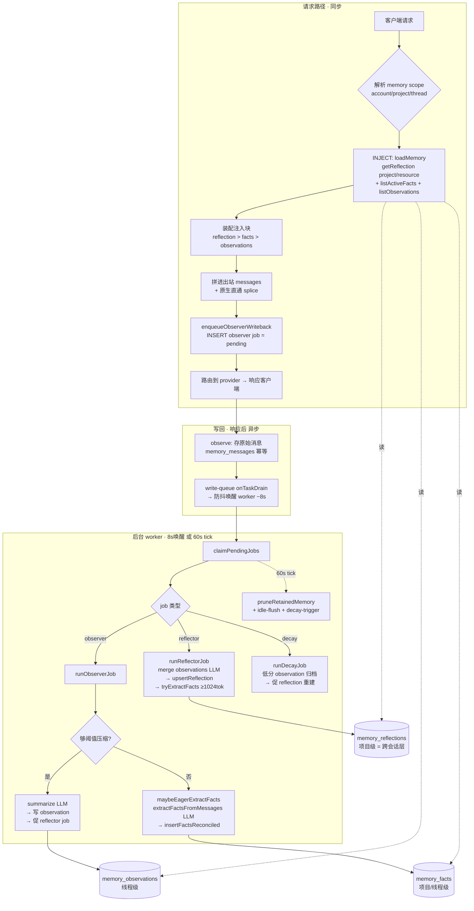

# 记忆模块全面 Review（2026-06-20）

> 背景：连续多次"修了又没好"，本文把整个记忆模块的代码、数据流、以及本轮排查出的所有 bug 一次性梳理清楚，并对"是不是过度设计"给出诚实评估。

---

## 1. 代码清单（按职责分组，~6700 LOC）

### 写入路径（记忆形成）
| 文件 | LOC | 职责 |
|---|---|---|
| `memory/observe.ts` | 235 | 把请求/响应的原始消息落库到 `memory_messages`（幂等去重）。**只存消息，不抽事实** |
| `memory/observer.ts` | 441 | 后台 observer 任务：压缩旧消息→observation；**eager 抽事实**（短句快车道） |
| `memory/reflector.ts` | 354 | 后台 reflector 任务：把一个 project 的 observations 合并成一条 **reflection**；批量抽 facts（≥1024 token 才触发） |
| `memory/compaction-policy.ts` | 339 | 压缩经济学：何时压缩（段大小/空闲/上下文压力），自适应定价 |
| `memory/scheduler.ts` | 276 | 后台 worker：60s 轮询 + **8s 防抖唤醒** 排空 `memory_jobs` 队列 |
| `memory/idle-flush.ts` | 93 | 把"安静但有未覆盖历史"的线程补一个 observer 任务 |

### 遗忘层（docs/12，独立子系统）
| 文件 | LOC | 职责 |
|---|---|---|
| `memory/forgetting/score.ts` | 112 | 遗忘分数：Ebbinghaus 半衰期×重要度×访问加成 |
| `memory/forgetting/decay.ts` | 262 | 衰减扫描：低分 observation 软归档；触发 reflection 重建 |
| `memory/forgetting/facts.ts` | 137 | fact 规范化（subject_key/content_hash）、批次去重 |
| `memory/forgetting/retention.ts` | 79 | 保留期硬删（**唯一的物理删除**：归档观察>30d、过期事实>90d；**永不删 reflection**） |
| `memory/decay-trigger.ts` | 73 | 决定何时入队 decay 任务 |

### 读取路径（注入）
| 文件 | LOC | 职责 |
|---|---|---|
| `memory/inject.ts` | 628 | 加载 reflection+facts+observations，按预算装配「注入上下文」 |
| `memory/inject-bridge.ts` | 180 | 把注入块拼进 IR 消息（尾随 `<system-reminder>` 轮） |
| `routes/native-memory-inject.ts` | 54→78 | 原生直通时把注入块拼进 Anthropic/Responses/**Gemini** 原生体 |
| `routes/memory-scope.ts` | — | 从 key/header 解析 `{accountId, projectId, threadId, mode}` |

### 存储 + 接线
| 文件 | LOC | 职责 |
|---|---|---|
| `store/sqlite/memory-store.ts` | 1494 | sqlite 适配器（全部 CRUD + 队列 + 去重 + 复活/supersede） |
| `store/postgres/memory-store.ts` | 1368 | pg 适配器（镜像） |
| `apps/gateway/src/memory-llm.ts` | ~540 | LLM 运行时：summarize/merge/extractFacts（deepseek），失败回退确定性 |

---

## 2. 数据流程图

**三层记忆 + scope（决定能否跨会话召回）**
- `observations`：**线程级** → 只在同一会话内可见。
- `reflections`：**项目级** → 跨会话召回的主力（新会话=新线程，靠它）。
- `facts`：owner+项目/线程级，`content_hash` 账号全局 → 持久 90 天的原子事实。

---

## 3. 本轮 bug 账本（这就是"为什么一直没好"）

| # | bug | 层 | 状态 |
|---|---|---|---|
| 1 | `eager_facts` 开关在 box 上是关的 → 短句无快车道 | 配置 | ✅ 已开（box） |
| 2 | 衰减半衰期 1 天太狠 → 记忆 ~3 天自我过期 | 配置 | ✅ 改 30 天（box） |
| 3 | deepseek 时而返回**裸数组**，schema 只认对象 → 事实被静默丢弃 | 代码 | ✅ 已发 v0.21.6 |
| 4 | Gemini 原生直通**不注入**记忆（缺 gemini 分支） | 代码 | ✅ 已发 v0.21.6 |
| 5 | fact 复活不刷新 scope → 跨 project 重述读不到 | 代码 | ✅ 已发 v0.21.6 |
| 6 | **eager 路径 `insertFactsReconciled` 未绑定 `this`** → `reading 'db'` → 可乐没记下 | 代码 | 🔧 本次修复（待发 v0.21.7） |

**为什么一个修复顶出下一个**：#3（schema）以前把数组拒了，路径根本走不到 `insertFactsReconciled`，所以 #6（未绑定 this）一直潜伏。#3 一修通，#6 立刻暴露。单测没抓到 #6 是因为假 store 的方法不依赖 `this`——已补一个 `this`-敏感的回归测试。

**反思被清空 ≠ bug**：日志证明是运营者（你）在 admin 页面手动删的（07:09 两次 DELETE）。代码里唯一的 reflection 物理删除就是这个两段式手动删除；自动遗忘管线永不删 reflection（Codex 已独立确认）。

---

## 4. "这事有这么复杂吗？" —— 诚实评估

**你是对的，核心确实简单**：收到请求 → 抽durable 事实 → 存表 → 下次注入。这个最小闭环 ~200 行就够。

**6700 行的复杂度来自这些"附加层"**：
1. **遗忘子系统**（decay/score/retention/consolidation，docs/12）——~660 行。把"记忆会衰减/归档/硬删"做成完整生命周期。**本轮多数 bug 的温床**（衰减太狠、复活 scope、reflection 删除语义）。
2. **三层记忆**（observation→reflection→fact）+ scope 矩阵——三套 LLM 抽取、三套读写、三种可见性。
3. **多协议 ×（翻译 vs 原生直通）**——OpenAI/Responses/Anthropic/Gemini 各一套注入拼接（#4 就是漏了一个）。
4. **双存储**（sqlite+pg 镜像）——每个改动写两遍。
5. **压缩经济学**（自适应定价/上下文压力触发）——339 行决定"何时压缩"。
6. **异步 worker + 防抖唤醒**——把形成放在请求路径外（#6 的 this-binding 就出在这条异步路径）。

**我的建议（如果要真正稳）**：
- **以 facts 层为主**：对"记住我的偏好"这类需求，`eager_facts`（抽原子事实→存→注入）已覆盖 90% 价值，且链路最短、最少 LLM 调用。
- **reflection/observation 层降级为可选**：它们引入了 scope 错配、衰减、删除语义等大部分复杂度。
- **遗忘层调温和或默认关**：1 天半衰期这种"会撒谎的旋钮"弊大于利；个人助理场景更需要"记得久"。
- **未绑定方法这类 bug**：根因是把 store 方法解构成变量再调用。可加一条 lint/约定：optional store 方法一律 `deps.memoryStore.x(...)` 或 `.call(deps.memoryStore, ...)`，禁止裸调。

---

## 5. 验证现状
- 本轮 6 个 bug 全部定位；#1–5 已上线 v0.21.6，#6 已修复+回归测试（待 v0.21.7）。
- 端到端：#3 修复已验证（reflection 正确含 42+绿色）；#6 修复后 eager 事实将真正落库。
- Codex 独立复核确认：observer.ts 是唯一未绑定调用；reflection 仅经运营者手动两段式删除。
