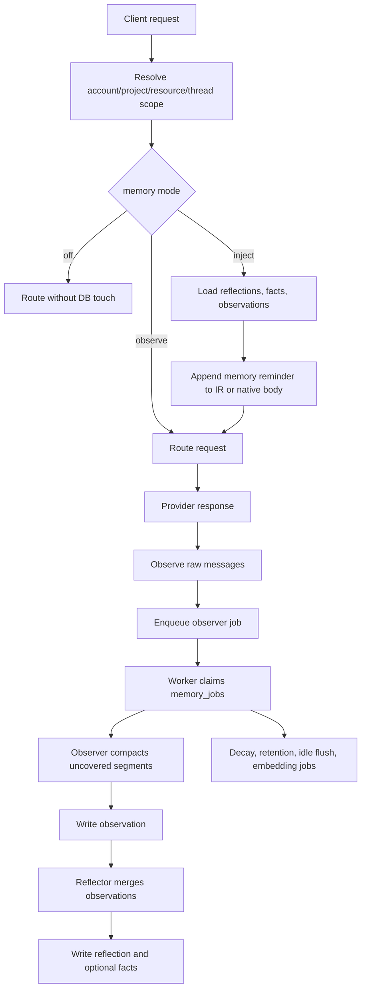

# Memory Module Review (2026-06-20)

Status: historical incident review, refreshed against the current source.

This note explains the memory pipeline and the June 2026 bug cluster that made
short "remember this" turns fail to become durable memory. Current implementation
details live in:

- `packages/core/src/memory/observe.ts`
- `packages/core/src/memory/observer.ts`
- `packages/core/src/memory/reflector.ts`
- `packages/core/src/memory/inject.ts`
- `packages/core/src/memory/inject-bridge.ts`
- `apps/gateway/src/routes/native-memory-inject.ts`
- `apps/gateway/src/routes/memory-scope.ts`
- `packages/core/src/store/sqlite/memory-store.ts`
- `packages/core/src/store/postgres/memory-store.ts`
- `packages/shared/src/config/memory-schema.ts`
- `config/memory.yaml`

## Current Pipeline

Memory has raw history plus three derived memory tiers:

| Layer | Scope | Purpose |
|---|---|---|
| Raw messages | Thread | Idempotent request/response history in `memory_messages`. |
| Observations | Thread | Compressed time-anchored summaries of older raw turns. |
| Reflections | Project/resource/thread | Merged cross-session summaries used for injection. |
| Facts | Project/resource/thread | Atomic durable facts, deduped by owner and content hash. |

The hot request path resolves memory scope, loads injectable memory when the mode
is `inject`, appends it to the outgoing request, and writes raw messages after the
response. Expensive work happens in background `memory_jobs`.

## Memory Formation

`observe.ts` stores raw messages and enqueues observer work. `observer.ts`
compresses uncovered raw-message segments into observations when the auto
compaction policy says there is enough size, idleness, or context pressure.

Short fact statements can bypass the compaction threshold through
`forgetting.consolidate.eager_facts`, but that path is deliberately gated:

- `memory.llm.enabled` must be true.
- `memory.forgetting.enabled` must be true.
- `forgetting.consolidate.eager_facts` must be true.

The schema rejects invalid combinations at startup. When wired, the observer mines
only new user turns, retries once on an empty LLM extraction, writes facts through
`insertFactsReconciled.call(memoryStore, ...)`, and fails open if extraction or
storage fails.

## Forgetting and Retention

The forgetting layer is configured in `config/memory.yaml` and validated by
`packages/shared/src/config/memory-schema.ts`.

Current defaults in the shipped config:

- `forgetting.enabled: true`
- `facts_retrieval.enabled: true`
- `score.half_life_s: 86400`
- `decay.archive_threshold: 0.05`
- `consolidate.trigger_tokens: 1024`
- `consolidate.max_facts_per_subject: 8`
- `consolidate.enable_llm_supersede: false`
- `retention.archived_days: 30`
- `retention.facts_expired_days: 90`

Important deletion semantics:

- Admin fact delete is soft: `status='pruned'` plus `expired_at`.
- Admin reflection delete is two-stage: active rows become archived; a second
  delete on an archived row purges archived versions for that scope.
- Forgetting retention hard-deletes only aged archived observations and expired
  facts. It does not hard-delete reflections.
- Raw messages are not part of the forgetting hard-delete path.

## June 2026 Bug Cluster

The original incident found six related problems:

| # | Problem | Current status |
|---|---|---|
| 1 | `eager_facts` was off in the live config, so short memory turns had no fast path. | Config/schema now expose the gate explicitly. |
| 2 | A very short half-life made memory decay too aggressively. | Current config documents the scoring knobs and retention windows. |
| 3 | The LLM extractor sometimes returned a bare array while the parser expected an object. | Fixed in the memory LLM extraction path. |
| 4 | Gemini native passthrough did not append memory. | `native-memory-inject.ts` now supports Gemini. |
| 5 | Fact resurrection did not refresh scope, so repeated facts could remain invisible in another project. | `insertFactsReconciled` handles resurrection and scope metadata in both stores. |
| 6 | The eager path called `insertFactsReconciled` without binding `this`, causing silent no-writes. | Current source uses `.call(deps.memoryStore, ...)` and has regression coverage. |

The important lesson was not that memory needed a larger feature surface. The
core user expectation is simple: remember a durable fact, store it, and inject it
later. The complexity comes from combining that expectation with background
compaction, three memory tiers, per-scope visibility, dual SQLite/Postgres
adapters, native passthrough injection, decay, retention, and optional LLM-backed
fact extraction.

## Operational Guidance

- Use facts for explicit user preferences and durable atomic claims.
- Treat reflections and observations as compression layers, not the primary
  storage for "remember this" statements.
- Keep `eager_facts` off unless an LLM memory model is configured and the operator
  accepts the extra background extraction calls.
- Use `idle_flush_max_age_s` when enabling idle backfill on an old database; this
  avoids spending tokens on cold historical threads.
- If memory appears empty in the admin page, check the tier being viewed. Raw
  `memory_messages` can exist even when no facts or active reflections have formed.
